# GlassBox-XAI
GlassBox is an AI system designed to help clinicians analyze medical images with greater accuracy and transparency. By combining advanced deep learning with explainable AI techniques, it highlights critical features in scans and clearly explains its decisions so healthcare professionals can trust and interpret results. This supports more accurate diagnoses, enhances patient safety, and complies with stringent healthcare regulations. 

At its core, GlassBox uses an Attention U-Net architecture tailored for medical image segmentation, alongside a comprehensive explainability suite including Grad-CAM, saliency maps, confidence overlays, integrated gradients, and layer-wise visualizations. Inference is visibly built incrementally in real time, enabling effective human-in-the-loop interaction that ensures decisions remain auditable and clinically aligned.

---

## Table of Contents
1. [Data Ethics & Full Disclaimer](#1-data-ethics--full-disclaimer)  
2. [Problem Domain](#2-problem-domain)  
3. [Solution Overview](#3-solution-overview)  
4. [Core Segmentation Features](#4-core-segmentation-features)  
    4.1. [Basic Segmentation Output](#41-basic-segmentation-output)  
    4.2. [Segmentation Overlay](#42-segmentation-overlay)  
5. [Comparative Model Evaluation](#5-comparative-model-evaluation)  
    5.1. [Variant Comparison Overlays – Batch A](#51-variant-comparison-overlays--batch-a)  
    5.2. [Model Performance on Test Set](#52-model-performance-on-test-set)  
    5.3. [Confusion Matrices – Test Set](#53-confusion-matrices--test-set)  
6. [Interpretability & XAI](#6-interpretability--xai)  
    6.1. [Superpixel Confidence Overlay](#61-superpixel-confidence-overlay)  
    6.2. [Saliency Map – Raw Logits](#62-saliency-map--raw-logits)  
    6.3. [Saliency Map – Sigmoid-Scaled](#63-saliency-map--sigmoid-scaled)  
    6.4. [Integrated Gradients Overlay](#64-integrated-gradients-overlay)  
    6.5. [Layer-wise Grad-CAM](#65-layer-wise-grad-cam)  
    6.6. [Full XAI in Practice: Insights](#66-full-xai-in-practice-insights)  
7. [Data](#7-data)  
8. [Models & Metrics](#8-models--metrics)  
9. [Image Processing Pipeline](#9-image-processing-pipeline)  
10. [Key Development Milestones](#10-key-development-milestones)  
11. [Future Work](#11-future-work)  
12. [Tech Stack & Dependencies](#12-tech-stack--dependencies)  
13. [Citations](#13-citations)  
14. [Author](#14-author)  
15. [License](#15-license)  

---

## 1. Data Ethics & Full Disclaimer

**This project is for research and demonstration purposes only. It is not a medical device and is not intended for clinical use, diagnosis, or treatment.**

**All medical images shown are sourced from the ISIC 2018 Challenge Dataset. A publicly released, fully anonymized dataset curated for non-commercial research. No private health information (PHI) is included.**

**All results and visual outputs are generated deep learning models and evaluated using the official ISIC 2018 test set for accuracy metrics. This work has not been validated in clinical settings.**

**No claims are made regarding diagnostic accuracy, safety, or fitness for medical decision-making.**

**Visualizations (e.g., segmentation masks, XAI overlays, etc.) are interpretability tools designed to support human understanding of model behavior. They are not clinical indicators.**

This work reflects a commitment to transparency, explainability, and responsible AI development in medical imaging and general XAI research. Please refer to the [ISIC 2018 dataset license and terms of use](https://challenge2018.isic-archive.com/) for attribution and usage guidelines.

---

## 2. Problem Domain
GlassBox XAI focuses on **automated binary segmentation of skin lesions** in medical images, a fundamental step toward early melanoma detection. Unlike basic classification, which simply detects the presence of a lesion, accurate segmentation outlines precise lesion boundaries. Potential applications include:

- **Risk Triage:** Flagging high-risk areas for deeper evaluation.

- **Quantitative Tracking:** Monitoring lesion growth or regression over time.

- **Decision Support:** Integration with Computer-Aided Diagnosis (CAD) tools and Human-in-the-Loop (HITL) Systems.

---

### 2.1. Why Explainability (XAI) Is Critical in Healthcare AI
Transparency in model decisions is essential for the safe and ethical adoption of AI in healthcare. XAI enables:

- **Clinician Trust & Human Oversight:** Visual tools like saliency maps and Grad‑CAM help clinicians verify model reasoning at the pixel level, supporting HITL workflows and shared decision-making.

- **Regulatory & Ethical Compliance:** XAI enables audit trails, bias detection, and decision transparency increasingly required by medical regulators (e.g., FDA).

- **Model Debugging & Iterative Improvement** Visualizations reveal model behavior under edge cases, guiding Subject Matter Expert (SME) feedback loops during development and evaluation.

- **Real-World Utility:** Studies show interpretable tools are more likely to gain clinician trust and improve diagnostic performance when used as assistive systems [(Holzinger et al., 2017)](https://arxiv.org/abs/1712.09923).

---

## 3. Solution Overview

### 3.1. Project Goals

- Build a fully custom solution for **ISIC 2018: Task 1 – Binary Segmentation** with performance that matches or exceeds top 2018 leaderboard entries.
- Adhere to ISIC 2018 challenge dataset splits (Training, Validation, Test) for quantitative benchmarking.
- Impose real-world constraints to reflect clinical deployment environments:
  - **Local-only pipeline**: Train, test, and deploy entirely on-device to ensure **PHI security**, **reproducibility**, and **offline deployability**.
  - **No pretrained models**: Supports **full model ownership**, traceability, and end-to-end auditability.
  - **No ensemble or high-cost methods**: Keeps **resource demands low**, enabling **deployment on modest hardware**.
  - **No cloud or external services**: Prevents data leakage and supports **secure, private use cases**.
  - **ISIC 2018-only training data**: Reflects **real-world limitations** in curated, domain-specific datasets.
- Train **three specialized model variants** to explore trade-offs across **precision**, **recall**, and **balanced performance**.
- Integrate a modular **XAI toolkit** to support **transparency**, **human-in-the-loop workflows**, and **regulatory readiness**.

---

### 3.2. Resources

- **Dataset**: Only the **ISIC 2018 Task 1 dataset** was used. This set is fully anonymized and publicly released for research. The dataset contains ~3000 dermoscopic images with corresponding ground truth segmentation masks, curated for the ISIC 2018 challenge. High-quality and widely used for benchmarking.
- **Hardware**: Local workstation with **NVIDIA RTX 3080**, **32 GB RAM**, and **AMD 3700X CPU**. No cloud or distributed compute used.
- **Timeline**: ~160 solo development hours over 4 weeks (not including documentation).
- **Development Context**: Developed by a solo researcher with specialization in **AI in Healthcare (Stanford University)**.

---

### 3.3. Performance Metrics

Model performance is measured by comparing its predicted segmentations to expert-annotated ground truth masks from the test set. These test images were **not seen during training**, so they reveal how well the model can **generalize** to new, unseen cases. This is a key indicator of real-world utility.

Each metric captures a different aspect of segmentation quality:

- **Dice Coefficient:** Measures how well the predicted lesion area overlaps with the actual lesion. More tolerant of small boundary errors in large lesions but highly sensitive to errors in small lesions, where precision matters most. Favored in medical imaging because it aligns better with clinical priorities, where missing a small lesion can have greater consequences than imprecise edges on a large one.
- **Intersection over Union (IoU):** Similar to Dice but stricter. Penalizes all boundary mismatches equally, regardless of lesion size. Often used as a secondary reference metric.
- **Recall (Sensitivity):** Measures how well the model captures all true lesion areas. High recall reduces false negatives.
- **Precision:** Measures how many of the predicted lesion areas were actually correct. High precision reduces false positives.
- **F1 Score:** The harmonic mean of precision and recall. Useful when both over-detection and under-detection carry risk.
- **Pixel Accuracy:** Shows the overall percentage of correctly labeled pixels. Can be misleading in medical imaging, where lesions often occupy only a small part of the image. For example, if just 10% of an image contains a lesion and the model misses it entirely, it still scores 90% accuracy.

**All metrics inform model performance, but Dice is emphasized due to its closer alignment with clinical relevance and its widespread use in medical image segmentation research.**

---

### 3.4. Variant Models

All three GlassBox XAI models use the **same core architecture**, but were trained and fine-tuned with **different loss functions** (Dice, Tversky, Weighted Hybrid, etc.) to optimize for distinct clinical and deployment goals:

- **Model 1 – Dice-Optimized:** Prioritizes high overall segmentation accuracy and maximization of the Dice Score.
- **Model 2 – Balance-Optimized:** Seeks an even trade-off between false positives and false negatives.
- **Model 3 – Recall-Optimized:** Minimizes false negatives, favoring sensitivity over specificity.

---

### 3.5. Core Segmentation Features

- **Binary Segmentation Output:** The raw model output. A binary mask showing which pixels the model identifies as lesion and which it identifies as non-lesion.
- **Segmentation Overlay:** Predicted mask, or boundary decision, dimmed and laid over the original image for segmentation. An essential step for evaluating segmentation accuracy.  
- **Image Preprocessing Pipeline:** Fifteen toggleable preprocesing techniques, such as brightness adjustment and/or dilation, can be applied to images prior to segmentation to improve model performance. These techniques have been omitted for this demo. All visuals and reported metrics reflect performance on the unaltered, baseline dataset.

---

### 3.6. Comparative Model Evaluation Features

- **Variant Comparison Segmentation Overlays:** Side-by-side visual comparison of all three model variants using the same image input. Highlights how each model handles boundary decisions differently based on specialization.
- **Test Set Performance Metrics:** Full evaluation across Dice, IoU, Precision, Recall, Pixel Accuracy, and F1 Score across all models.
- **Confusion Matrices:** Pixel-level false positive, false negative, true positive, and true negative rates for the entire test set across all models. High-level picture of strengths and trade-offs.

---

### 3.7. Interpretability & XAI Features

- **Confidence Map Overlay:** Heatmap showing model confidence in its decisions across different regions of an image. Essential context for model decision transparency.
- **Saliency Map Overlay:** Highlights which pixels most strongly affect the model’s output, based on local sensitivity. Typically emphasizes edges or boundaries where predictions shift sharply. 
- **Integrated Gradients Overlay:** Measures cumulative influence of each pixel by comparing the image to a baseline. Unlike saliency maps, IG reveals focus on both the core and edges of a lesion, offering a more complete view of what drives model decisions.
- **Grad-CAM Visualizations**: Visualization of the progression from image input to model output, across all convolutional layers. Divided into encoder, attention, decoder, and output stages to show how segmentation decisions evolve through the network architecture.

---

### 3.8. Model Metrics

| Model              | Dice     | IoU      | Precision | Recall   | Pixel Accuracy | F1 Score |
|-------------------|----------|----------|-----------|----------|----------------|----------|
| **Dice-Optimized**   | **0.8751** | **0.8000** | **0.9028**  | 0.8291   | **0.9272**      | 0.8644   |
| **Balance-Optimized**| 0.8734   | 0.7925   | 0.8787    | 0.8564   | 0.9267         | **0.8674** |
| **Recall-Optimized** | 0.8573   | 0.7669   | 0.8280    | **0.8936** | 0.9182         | 0.8595   |

---

### 3.9. Solution Summary

GlassBox XAI achieves **Dice 0.8751** and **IoU 0.8000**, meeting or exceeding top entries from the ISIC 2018 leaderboard, **without relying on pretrained models, external data, or ensemble methods**. While some modern models (2024–2025) may report Dice scores above 0.90, these typically require computationally expensive techniques, substantial cloud infrastructure, or proprietary data pipelines.

By contrast, GlassBox was developed **entirely from scratch**, trained on limited data, and runs **securely on local hardware** with **end-to-end auditability**. It is suitable for real-world clinical deployment where **privacy, traceability, and model ownership** are critical design factors.

In short, this system delivers **high-tier performance under realistic clinical constraints**, while also offering **powerful visual diagnostics**, **exceptional model transparency**, and **flexibile, local deployability** not often found in more opaque, compute-heavy solutions.

These trade-offs, and potential development paths for GlassBox XAI, are explored more thoroughly in the **Future Work** section.

---

## 4. Core Segmentation Features

The visuals below demonstrate the core segmentation capabilities of GlassBox XAI. While all features support all model variants and image batches, we primarily showcase **Model 1 (Dice-Optimized)** with **Batch A (Average Performance)** for clarity, consistency, and realistic baseline performance.

- **Batch A (Average Metrics):** Mirrors the models' average performance on the full test set. Represent typical, expected outcomes. Contains some challenging edge case images.
- **Batch B (High Metrics):** Outperforms full test set metrics. Illustatrates optimal use cases. Contains no edge case images.
- **Batch C (Low Metrics):** Underperforms full test set metrics. Useful for evaluating edge cases or failure points. Contains many edge case images.

---

### 4.1. Basic Segmentation Output

This section demonstrates how raw model predictions are turned into clear visuals that support decision-making. The primary output is a binary segmentation mask, highlighting lesion regions on a per-pixel basis. Here we have the base image to be segmented, the expert annotated mask, and the models' outputted mask for comparison. 

Ground truth masks, expert-annotated and included for evaluation, allow us to compare model output visually and calculate performance metrics across the batch. 

---

#### Basic Segmentation Output - Model 1 - Batch A

---

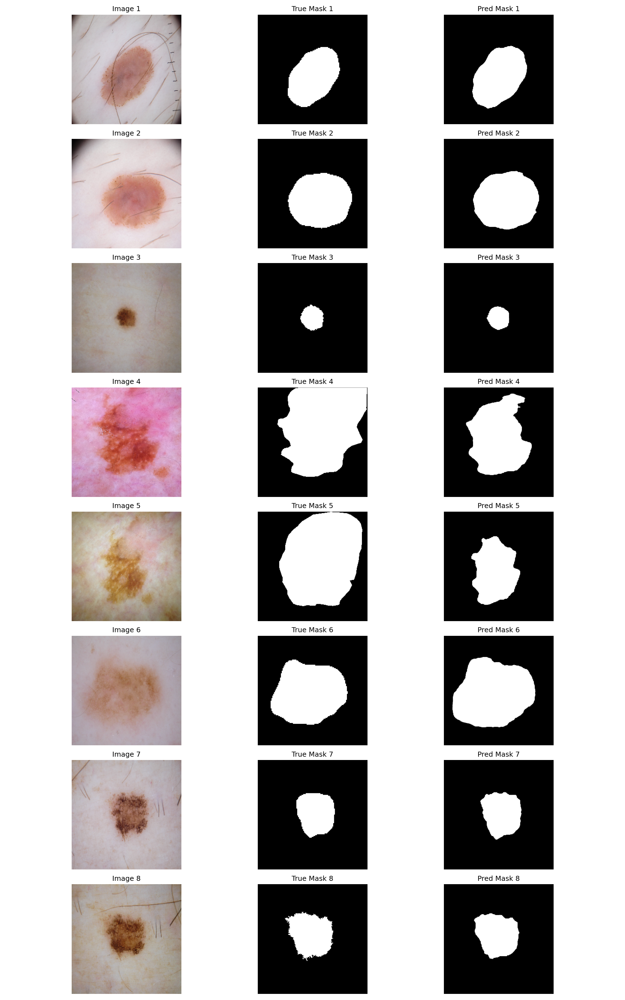

---

### 4.2. Segmentation Overlay

To make predictions visually intuitive, we overlay the dimmed segmentation mask on the original image. This creates a human-readable output that can be compared directly with expert annotations. We include overlays for both the model and expert masks, along with batch-level performance metrics for context.

---

#### Segmentation Overlay - Model 1 - Batch A
This visual uses Batch A, representing expected mean performance. The model's segmentation boundaries align closely with the expert-annotated boundaries, aside from images 4 and 5, which are aligned but undersegmented. Image 6 is slightly oversegmented, but still shows excellent shape alignment. 

---

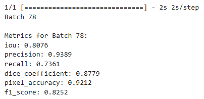

---

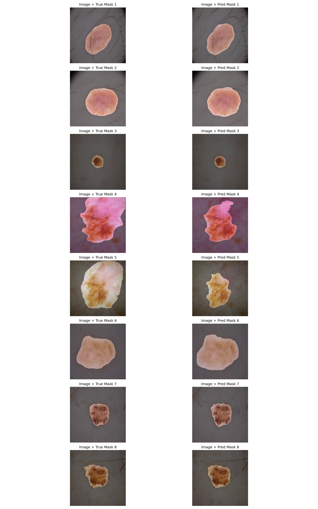

---

#### Segmentation Overlay - Model 1 - Batch B
This visual uses Batch B, representing optimal use case. The model's segmentation boundaries very closely mirror the expert-annotated boundaries. Only slight misalignment in images 3, 5, and 6.

---

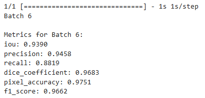

---

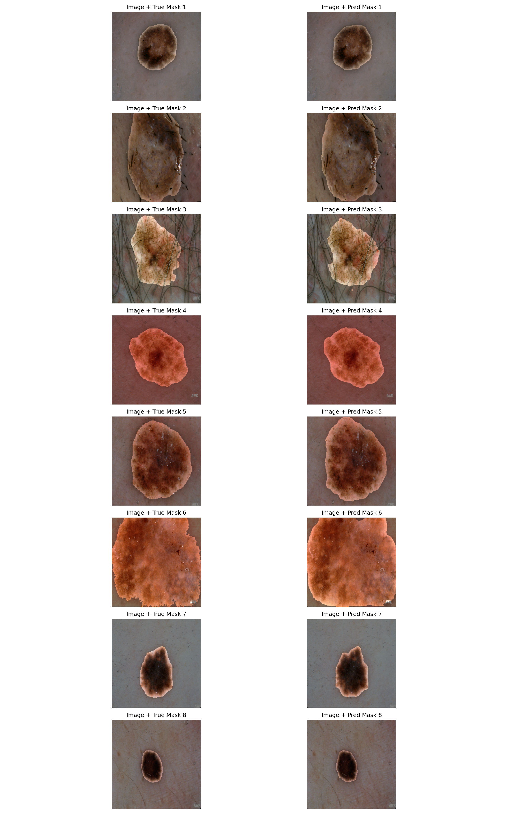

---

#### Segmentation Overlay - Model 1 - Batch C
This visual uses Batch C, representing edge cases and failure points. The model's segmentation boundaries align relatively closely with the expert-annotated boundaries for images 6, 7, and 8. However, the model is missing portions of the lesion in images 1, 2, 3, 4 and 5.

---

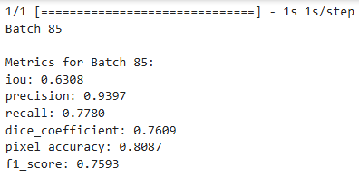

---

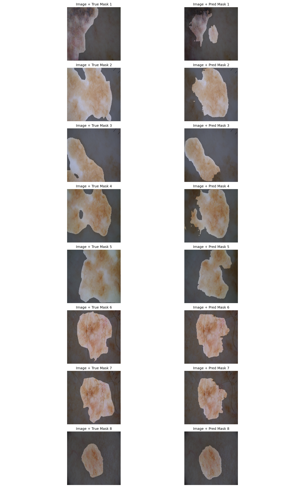

---

## 5. Comparative Model Evaluation
Building trust in AI systems requires more than clean outputs; it requires **objective, transparent evaluation**. This section compares the performance of three models trained on the same task to show how different training strategies affect generalization, error profiles, and suitability for specific deployment needs.

---

### 5.1. Variant Comparison Segmentation Overlays - All Models - Batch A
Here we visualize the segmentation decision of all 3 variant models for comparison. For Batch A, differences are notable but not pronounced between variants. Other batches show greater divergence. 

---

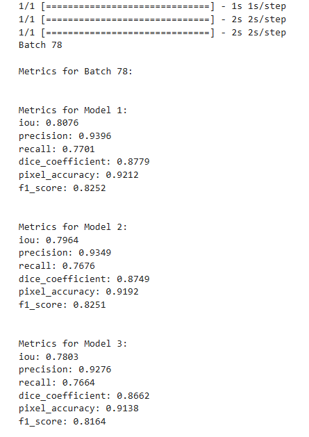

---

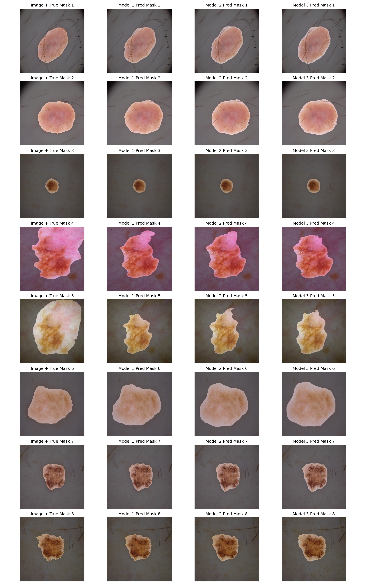

---

### 5.2. Model Performance Evaluation on Test Set - All Models - Test Set
All three GlassBox XAI models achieve strong overall performance on the held-out test set. However, their error patterns differ meaningfully. The clearest differentiator is how each model balances Precision and Recall, or the rate of false positives versus false negatives at the pixel level.

---

#### Model 1 - Dice-Optimized
Precision is higher; Recall is lower.

---

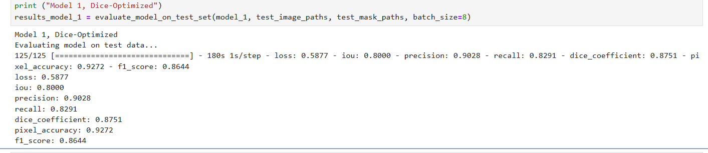

---

#### Model 2 - Balance-Optimized

Precision and Recall are balanced.

---

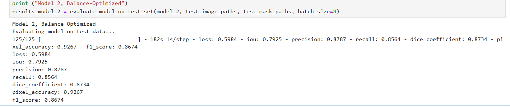

---

#### Model 3 - Recall-Optimized

Precision is lower; Recall is higher.

---

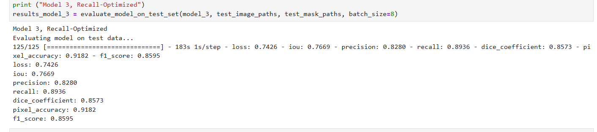

---

### 5.3. Confusion Matrices - All Models - Test Set

Confusion matrices break down  correct and incorrect predictions on a per-pixel basis across the entire test set. This provides a more detailed view of where and how errors occur, especially for medical applications where every pixel may carry diagnostic weight.

These matrices reveal a consistent pattern across variants: as false positives increase, false negatives decrease, and vice versa. This does not indicate a drop in overall performance, each model remains highly accurate. Rather, it reflects how each was intentionally optimized for different risk profiles and deployment scenarios using custom loss functions. 

In medical imaging, false positives are more acceptable than false negatives if missing a condition, or part of a condition, could lead to serious consequences. In other contexts, such as when treatment carries significant risk or the condition is less severe, a higher false negative rate may be tolerable. Alternatively, we can aim for balance. These preferences can also be fine-tuned more granularly through thresholding and curve analysis to further specialize model behavior.

---

#### Model 1 - Dice-Optimized
~2.5% of test pixels are false positives; ~4.8% are false negatives. 

---

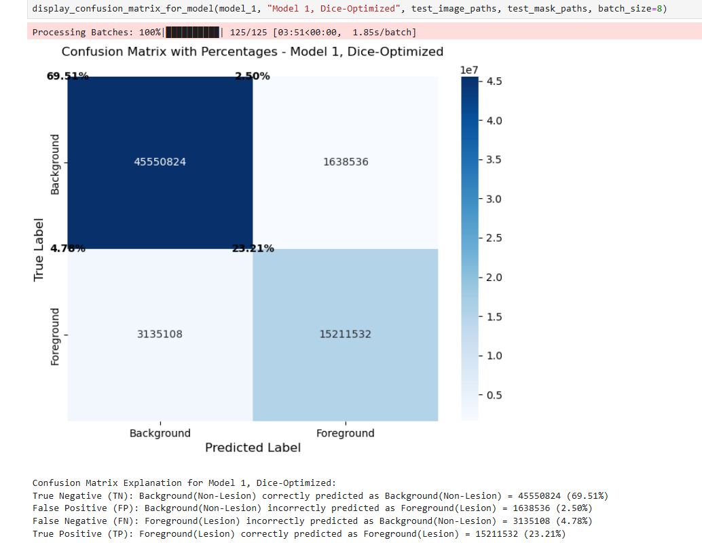

---

#### Model 2 - Balance-Optimized 
~3.3% of test pixels are false positives; ~4.0% are false negatives.

---

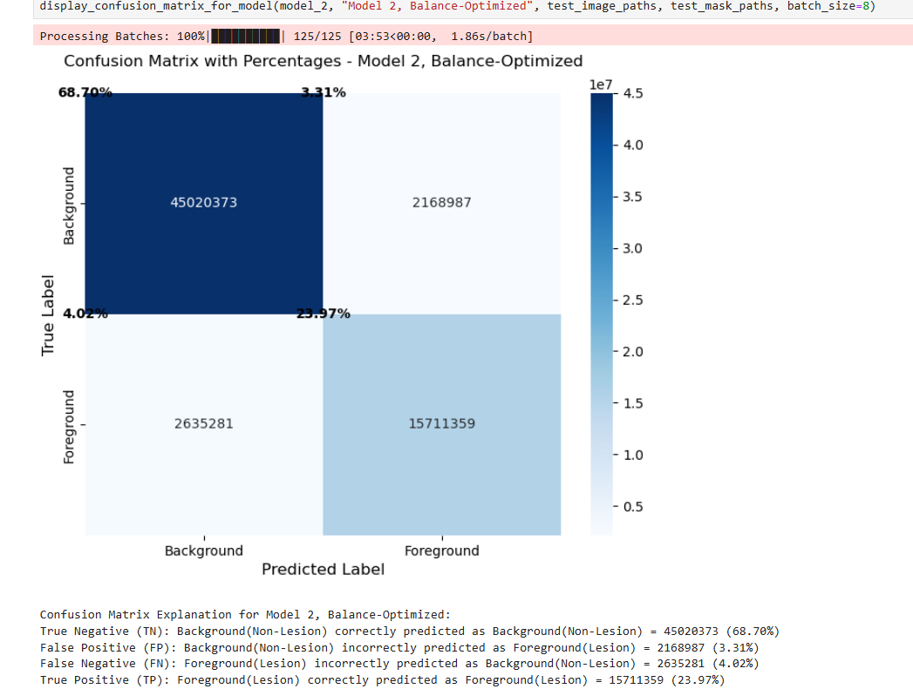

---

#### Model 3 - Recall-Optimized 
~5.2% of test pixels are false positives; ~3.0% are false negatives. 

---

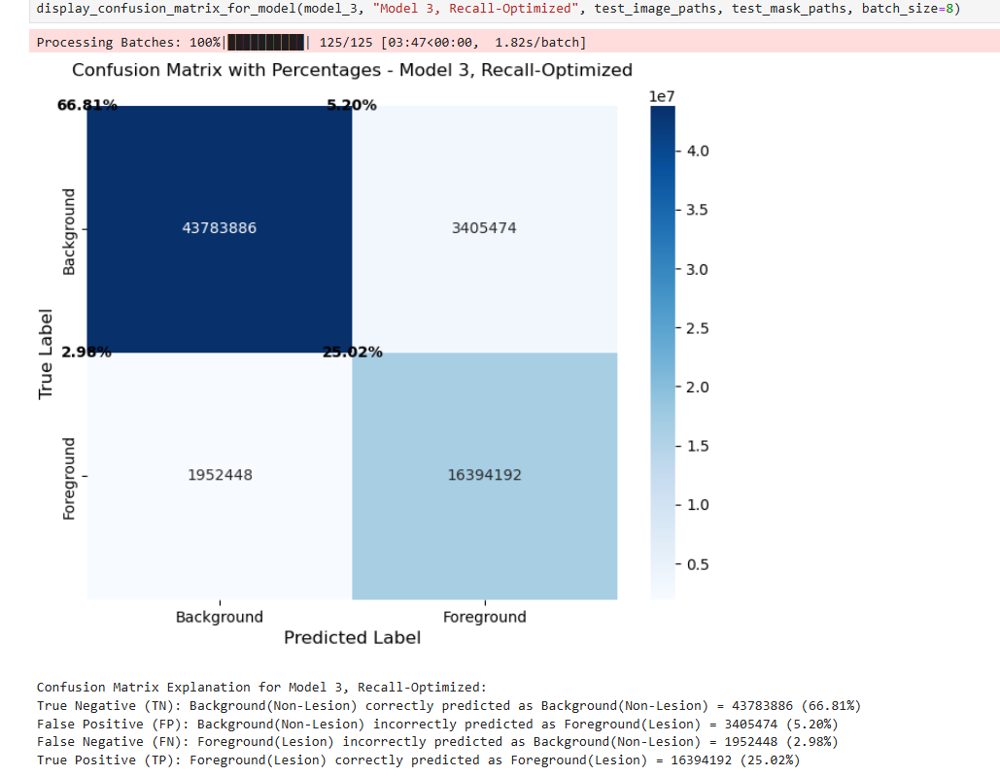

---

## 6. Interpretability & XAI
Understanding how and why a model makes its predictions is essential for trust, regulatory compliance, clinical safety, and real-world deployment.

This section introduces a suite of interpretability tools designed to help researchers, clinicians, and auditors explain, interrogate, and validate model behavior beyond raw performance metrics. These include:

- **Superpixel Confidence Overlay** for spatial model confidence.

- **Saliency Overlay (Raw Logits and Sigmoid-Scaled)** for sensitivity and decision contribution.

- **Integrated Gradients Overlay** for robust attribution.

- **Decision Path Visualization via Layer-wise Grad-CAM** for full progression from input to output.

Each method highlights a different aspect of the model's internal decision-making, allowing us to ask critical questions:

- Did the model focus on the lesion or background noise?

- Did it attend to misleading non-lesion features (e.g, hairs, moles, shadows) but ultimately learn to discard them correctly?

- Is it relying on human-visible features or irrelevant correlations?

- Does confidence behave as expected? High confidence in lesion cores but decreasing at the boundaries, as we expect to see, where the model has to decide precisely where to draw the segmentation boundary? 

- Does confidence drop near errors? Or does the model make errors with confidence?

- Are attention mechanisms effective? Do we see increased focus on relevant features and decreased focus on irrelevant features when applied?

Whether auditing model attention, evaluating edge cases, or designing a transparent system for actionable human-in-the-loop (HITL) decision support, **XAI is foundational**.

We will continue using Batch A, the average performance set of images, an an example. Pay particular attention to the difference between the images the model segments precisely and images 4 and 5 (which were undersegmented) and 6 (which was slightly oversegmented, but precise in shape).

---

### 6.1. Superpixel Confidence Overlay
This visualization shows the model’s segmentation prediction overlaid with a heatmap of per-pixel confidence, grouped into superpixels (clusters of visually similar pixels). Each region is color-coded based on how confidently the model believes it is part of the lesion (positive class). This breaks a segmentation decision into parts, showing where the model has high confidence and where the model has low confidence.

---

#### What This Tells Us

- **Deep red:** Very high confidence. Typically in core lesion area.

- **Orange-yellow-green-blue:** Varying confidence near lesion edges, as expected.

- **Clear blue background:** High confidence that this area is not part of the lesion. 

---

#### Why It Matters
- **Pinpoints areas of uncertainty** to help human reviewers identify where predictions may need manual verification.

- **Supports HITL** workflows by letting a human expert know how much weight to give the model's individual predictions, especially in borderline or ambiguous cases.

- **Debugging & QA** during development iterations to detect patterns, edge cases, and failure modes like overconfidence in incorrect segmentaton decisions.

---

#### Superpixel Confidence Overlay - Batch A

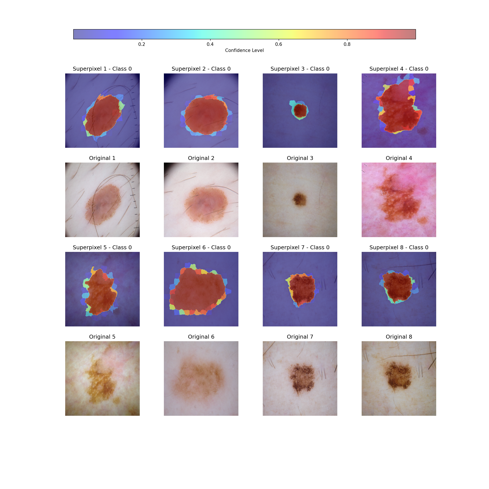

---

#### Observations

This behavior is exactly what we expect. High confidence in the lesion core, more uncertainty at boundaries, and strong rejection of background regions for all images. Even well-trained segmentation models will experience some uncertainty as to where the exact boundary should be. It is inherently much easier to identify the core of the lesion than exactly where it ends.

Notice the difference between images 4, 5, and 6 compared to the others. We see more uncertainty in these images than the others. When we examined the metrics earlier, we saw images 4 and 5 were undersegmented compared to the expert annotation. Image 6 was slightly oversegmented, but still had excellent shape alignment. 

The images with smaller lesions have less uncertainty around the border. This makes sense, as we are using Model 1 - Dice-Optimized. It was trained using a Dice loss function, which penalized errors on small lesions more than errors on large lesions. This specialization is important because an error on a large lesion results in detection of the lesion but with imperfect segmentation. This is much less likely to lead to negative consequences than missing a small lesion entirely. 

---

#### Technical Note
Superpixels are generated using the SLIC algorithm to divide the image into super-pixel regions. Confidence values are calculated by averaging the model’s probability outputs within each region, resulting in a smoother and more interpretable heatmap. My understanding is that this technique is not common practice, but it seems obvious to me in technical implementation and HITL utility. I could not find equivalent examples of this, or standard terminology, for citation.  

---

#### Real-World Use Case
This overlay could help a dermatologist triage ambiguous cases. Low-confidence boundaries may prompt further review, while high-confidence regions offer reassurance. This supports risk-aware decision-making and calibrates trust in model outputs on a per-image, or even per-region, basis. Even high-performance models make mistakes. This overlay allows experts to know when, and even where, model output should be given higher or lower trust. 

---

#### Disclaimer
This system is for research and educational use only. Visuals and insights are based on the ISIC 2018 dataset and are not clinically validated.

---

### 6.2. Saliency Map Overlay - Raw Logits

This visualization highlights where the model is most sensitive to small changes in the input image. Each pixel is color-coded based on the gradient magnitude flowing from the raw logits (pre-sigmoid output) with respect to the input. The result is a high-resolution "sensitivity heatmap" showing all areas the model reacts to whether helpful, distracting, or irrelevant. For example, we notice that non-lesion objects, like hairs, are consistently hot pixels here but these do not affect or confuse the model's final output. We will see why this is further down the XAI pipeline.

---

#### What This Tells Us
- **Clusters of “hot” pixels:** Regions the model is highly sensitive to, often aligned with textures or segmentation boundaries.

- **Sensitivity outside the lesion:** Includes background features the model reacts to, such as lighting patterns or skin texture.

- **Wide attribution scope:** Captures all contributing input signals, not just the ones the model ultimately trusts in its final prediction.

---

#### Why It Matters
- **Exposes early model behavior** during R&D and debugging phases to identify spurious correlations (e.g., hair, shadows, borders).

- **Improves trust & safety** by revealing if a model is overly sensitive to irrelevant signals, overshadowing or distorting more relevant signals.

- **Enables data-driven fixes** as “hot spots” in irrelevant areas may signal a need for improved data augmentation, attenton mechanisms, pre-processing techniques, annotation quality, or fine tuning on edge cases.

---

#### Saliency Map Overlay - Raw Logits - Model 1 - Batch A

---

#### Observations

This gives us a raw view of influence without filtering. Valuable for understanding early-stage model behavior or unwanted signal dependencies. Under close examination of noisy heatmaps, we can see that the hottest pixels generally correspond to segmentation boundaries. 

Notice how images 4, 5, and 6 are noisier than the images the model segments precisely. Also, notice how misleading non-lesion features, like hair or shadows, create hot pixels here but do not affect the accuracy of the model's final output. This will become clearer when we look at sigmoid-scaled saliency overlays next.

---

#### Technical Note
Gradients are computed using TensorFlow’s GradientTape, capturing how small input changes influence the raw logits. This is achieved by cloning the model and temporarily removing the sigmoid activation from the output layer during backpropagation, allowing direct access to the raw logits. This method can appear noisy and doesn't necessarily represent final prediction logic. This is addressed in sigmoid-scaled saliency and integrated gradient techniques, and how they all work together synergistically.

---

#### Real-World Use Case
In a research workflow, an ML engineer or clinical auditor might use this map to detect whether the model is reacting to imaging artifacts or unintended features. For example, consistent sensitivity to non-lesion areas could inform dataset refinement, retraining with augmentation, or model regularization. Additionally, we can use this to determine the effectiveness of model architecture, attention mechanisms, and feature engineering. Does a noisy image here ultimately lead to a clear, accurate, segmentation boundary?

---

#### Disclaimer
For research and educational use only. Visuals and insights are based on the ISIC 2018 dataset and are not clinically validated.

---

### 6.3. Saliency Map Overlay - Sigmoid-Scaled

---

This visualization is much less noisy than the previous saliency map because the only hotspots are pixels that most influence the model’s final segmentation decision. This is computed using gradients of the sigmoid-activated output with respect to the input image. Unlike raw saliency maps which reflect all sensitivity, this map focuses only on what most affects the model’s final probability. The result is cleaner, more focused, and ideally emphasizes the lesion boundary.

---

#### What This Tells Us
- **Lesion boundary:** A thin band of pixels outlines the model’s segmentation decision.

- **Interior & background:** Remain mostly blue (low gradient), showing low influence on the final segmentation decision. The model knows the interior is part of the lesion, of course, but its segmentation decision is based on where the edges are.

---

#### Why It Matters
- **Improves interpretability** by aligning attribution with the model’s actual output (post-activation), not just internal activations.

- **Highlights decisive features** rather than noisy sensitivities, making it easier for clinicians or auditors to validate the reasoning. 

- **Strong HITL value** in expert review settings. Boundary-focused saliency supports targeted oversight of lesion delineation quality, particularly when compared and contrasted with raw logit saliency maps for the same input image.

---

#### Saliency Map Overlay - Sigmoid-Scaled - Model 1 - Batch A

---

#### Observations

Optimally, a well-trained model should not react broadly to irrelevant textures or lighting. Instead, it should focus narrowly on lesion boundaries, fine-tuning its segmentation decisions. We observe this behavior in the majority of images, where segmentation quality is high and saliency hotspots trace the lesion outlines precisely.

This pattern holds across most cases (particularly Images 1, 3, 7, and 8) though some maps are sharper than others.

Image 4 is a notable exception. Here, the saliency map reveals diffuse hotspots concentrated in the top-right region. This is the exact area the model undersegments in its final output. Meanwhile, the central region of the lesion, which the model segments correctly, shows minimal saliency activation.

This contrast suggests the model has already "resolved" the central area with confidence, so it no longer contributes significantly to the gradient. In contrast, the top-right region remains ambiguous, actively influencing the model’s decision-making even in the final layer.

This supports a broader pattern: where saliency is focused, the model is refining its decision. In high-confidence cases, this focus occurs at the lesion boundary and suggest a focus on optimizing precision. In edge cases like Image 4, saliency shifts toward uncertain regions. It is still focused on resolving this area and not on optimizing its final prediction. This results in a generally accurate but imprecise segmentation boundary with the uncertain area specifically under-represented. 

---

#### Technical Note
This saliency map is computed using gradients derived from the sigmoid output, not raw logits. This constrains gradients to the final prediction layer, filtering out noisy activations. Compared to raw saliency, this produces smoother, cleaner, and more decision-aligned visualizations. Sigmoid-scaled saliency limits attention to the model’s final confidence output. Raw saliency highlights all input regions that influence internal activations, resulting in broader, noisier maps that often include background or texture noise. This difference is especially useful for auditing attention mechanisms and boundary fidelity when used together.

This implementation for saliency is not standard, and perhaps should not be called a saliency map at all. Standard implementation is what we did previously, using raw logits. However, so long as we understand the difference between what the two maps are showing, both are useful XAI techniques. Raw saliency shows sensitivity, sigmoid saliency shows decisions.

---

#### Real-World Use Case
In a dermatology AI pipeline, this overlay could help clinicians visually confirm the quality of lesion boundaries in low-confidence or borderline cases. If the focus aligns with clinically relevant features, trust is reinforced. If not, it flags potential model failure or edge-case behavior. Together, raw and sigmoid-scaled saliency offer a full-spectrum view of model behavior. Raw saliency reveals what the model notices, while sigmoid-scaled saliency shows what it actually acts on. This duality is critical for auditing feature dependence and evaluating attention mechanisms applied at intermediate convolutional layers.

---
 
#### Disclaimer
For research and educational use only. Visuals and insights are based on the ISIC 2018 dataset and are not clinically validated.

---

### 6.4. Integrated Gradients Overlay

This visualization highlights the cumulative influence of each pixel on the model’s final segmentation decision, computed by tracing a path from a baseline (blank) image to the actual input. The result is a smoother, more stable attribution map compared to instantaneous saliency techniques. Integrated Gradients don’t just show what the model is sensitive to. They reveal which input features actually caused the prediction, traced along a path from blank input to final decision. Integrated gradients, alongside raw and sigmoid saliency, distinguish between what the model reacts to, what it acts on, and what it ultimately bases its decision on.

---

#### What This Tells Us
- **Bright, saturated regions:** These pixels consistently contributed to the model’s prediction as the image was progressively revealed and should correspond to the lesion.

- **Dark or desaturated regions:** These pixels had little to no effect on the model’s decision, suggesting they were ignored or discounted. 

---

#### Why It Matters
- **Reduces noise** compared to raw saliency methods, offering more stable attribution maps.

- **Highlights causal contributions** instead of just attention or sensitivity, supporting model explainability during audits.

- **Improves interpretability in edge-cases** where gradients alone may be misleading or noisy.

---

#### Integrated Gradients Overlay - Model 1 - Batch A

---

#### Observations
Unlike what we saw in the raw logits saliency maps, hot spots here do not align with misleading features (hairs, shadows, etc.). We know the model noticed these features, from the raw logits saliency maps, but we also know these features were ultimately judged to be misleading, from the integrated gradients maps. Here we see how robust XAI techniques work together to reveal how models make decisions at a granular level. And we can examine this even further with when we look at the next section, Decision Path Visualization via Layer-wise Grad-CAM.

Most images are remarkably consistent here. High-importance regions (green/yellow clusters) largely coincide with lesion boundaries and internal texture, even in difficult cases. For example, Image 3 shows a tight, centralized attribution corresponding precisely to a small lesion. Images 1, 2, 7, and 8 also show well-localized attribution consistent with lesion contours. Meanwhile, Image 6 exhibits broader but clear attribution, aligning with its mild oversegmentation but precise shape. 

Image 4 is diffuse and a clear outlier, however. Most likely due to the presence of two clearly different colors in one lesion. An edge case that can be understood and addressed through input preprocessing, expanding training data, or additional data augmentation. Overall, the integrated gradients confirm the model is prioritizing relevant visual features, and supports prior XAI observations.

---

#### Technical Note
Like the raw logits saliency map, IG is applied to the model’s pre-sigmoid logits to ensure faithful attribution. Integrated gradients computes an attribution map by interpolating between a baseline image (blank) and the input image, calculating gradients at each step and summing them along the path. Unlike raw gradients, this method integrates over scaled versions of the input, producing more stable and meaningful attributions. One of the most robust attribution methods in XAI literature. 

---

#### Real-World Use Case
In a dermatology AI pipeline, Integrated Gradients can help validate that a model is grounded in the right lesion features when raw saliency is too noisy or unclear. It can also reveal subtle dependencies on shape, texture, or contrast that affect generalization across skin tones, lighting conditions, or imaging devices. When used alongside saliency and confidence maps, model behavior can be interpreted through three complementary lenses: sensitivity, decision confidence, and causal attribution.

---

#### Disclaimer
This visualization is for research and educational purposes only. Visuals and insights are based on the ISIC 2018 dataset and are not clinically validated.

---

### 6.5. Decision Path Visualization via Layer-wise Grad-CAM
This visualization illustrates how different parts of an image influence the model’s segmentation decision across its entire architecture. We follow a batch of images from input to final output. At each major stage (encoder, attention bottleneck, decoder, output), we apply Grad-CAM to highlight spatial regions that most strongly affect the model's prediction.

These heatmaps reflect class-specific activation relevance, revealing how the model’s internal focus evolves layer by layer and solidifies into a segmentation decision.

---

#### What This Tells Us
- **Warm Regions:** Areas of strong positive activation for the predicted class

- **Cool Regions:** Areas of low activation.

- **Note:** Different layers focus on different features, especially in the encoder layers. We do not expect to see broad activation during feature extraction. 

---

#### Why It Matters

- **Provides an end-to-end** look at internal activations across any decision the model makes. Rare in modern AI.

- **Enables auditability** through analyzing where errors occur or where edge cases deviate from expected behavior. 

- **Trust calibration** helps human experts understand whether the model is reasoning in a way that aligns with clinical or domain-specific logic.

- **Granular model analysis** reveals opportunities for iterative improvement. Unstable stages can be identified and architecture fine tuned.

---

#### Technical Note
Grad-CAM (Gradient-weighted Class Activation Mapping) is a visualization technique that highlights which parts of an input image most influence a model’s prediction. It works by backpropagating gradients from the output layer to specific convolutional layers and weighting those activations by their importance to the final decision.

Grad-CAM is most commonly applied to image classification models, where it reveals which image regions contributed most to a predicted class (e.g., Dog vs. Cat). In such models, a single label is predicted for the entire image, and the Grad-CAM heatmap explains the basis for that classification.

In contrast, GlassBox XAI is a segmentation model, where classification is performed at the pixel level to distinguish lesion from non-lesion regions. While the prediction output is spatial (a mask), each pixel still represents a classification and Grad-CAM can be extended to this context.

In this implementation, Grad-CAM is applied at four major layer groups: Encoder, Attention Bottleneck, Decoder, and Output Layer. This layer-wise view tracks how the model's spatial focus evolves across the entire architecture. It allows us to visualize how low-level features are detected, how attention is modulated, and how these features are reassembled into a final segmentation decision.

---

#### Real-World Use Case
A dermatologist reviewing model predictions can use these heatmaps to verify whether internal reasoning aligns with known lesion features. For instance, if the model strongly activates around hairs or shadows, that may warrant caution or fine-tuning if these features are not ultimately disregarded in the final output.

Developers can isolate and analyze architecture components to better understand behavior:

Is the attention gate filtering appropriately?

Does the decoder preserve relevant detail?

What changes when the attention mechanism is disabled or modified?

This approach supports HITL workflows, interpretability, and model debugging in regulated or safety-critical domains. 

---

#### Disclaimer
These visualizations are for research and educational purposes only. Visuals and insights are based on the ISIC 2018 dataset and are not clinically validated.

---

#### Decision Path Visualization via Layer-wise Grad-CAM - Encoder Layers - Model 1 - Batch A

This first set of heatmaps shows Grad-CAM activations at successive convolutional layers within the encoder layers. The encoder is responsible for progressive feature extraction. The raw input is transformed into increasingly abstract, compressed representations. These layers downsample the input spatially while amplifying features relevant to the task, such as lesion texture, border contrast, and color patterns.

Early encoder layers should focus on low-level visual cues while deeper encoder layers should transition toward more localized semantic regions related to the lesion itself.

---

---

##### Observations
Across all 8 images, we observe a strong alignment with expectations. Early layers capture texture and fine contrast across the image. Gradually, the focus contracts toward the lesion region. Background, hairs, and lighting artifacts are picked up but increasingly ignored. Most images show precise activations even in early layers. 

The activations for images 1 and 2 are primarily related to hairs and shadows, misleading artifacts. However, both images will ultimately be well-segmented; these features did not contribute to the final output.

Image 3 demonstrates that the encoder handles small, well-defined lesions with high confidence and precision. This is expected, as Model 1 is optimized for Dice performance. It was penalized more for making mistakes on small lesions rather than large lesions. This aligns with our goals for this model. It is unlikely to miss any lesion, whether large or small. However, its segmentation borders for larger lesions may be less precise. This also may explain the undersegmentation in Images 4 and 5, which feature larger lesions.

Early convolutional layers filter raw visual signals, and deeper encoder layers refine focus toward the lesion. Grad-CAM reveals that in most cases, the encoder is forming a solid lesion representation.

---

#### Decision Path Visualization via Layer-wise Grad-CAM - Attention Bottleneck Layers - Model 1 - Batch A

This visualization highlights activations through the point of maximum compression. The encoder's abstracted features are passed forward to the decoder for reconstruction. In this architecture, the bottleneck also includes an attention gate, a hybrid mechanism that modulates the encoder's skip connections using both additive and multiplicative transformations. Attention is applied here, selectively filtering what information gets passed along skip connections to suppress irrelevant or misleading features and highlight semantically meaningful regions.

Activations should be tighter and more class-specific than the encoder. Attention gating should emphasize lesion areas while downplaying background. Ideally, this will correct cases where the encoder under or over attended to features before they are passed to the decoder layers for reconstruction.

---

##### Observations
Strong consistency across all 8 images. Lesion regions are clearly activated and surrounding skin, hairs, and background are clearly suppressed. This shows effective attention gating that will be seen even more clearly in the decoder layers. 

Image 3 is clearly an optimal case, as expected. This aligns with the confidence metrics we saw in the Superpixel Confidence Overlay earlier for this image. 

Images 1, 2, 6, 7, and 8 also show clear, dense activation aligned with the final boundary decision. 

Both images 4 and 5 contain two lesion areas that are of different and contrasting color. The model picks up much of the differently colored region, away from the core, but does not capture all of it. We have identified a possible consistent feature with these 2 edge cases. Additionally, as both are also larger lesions, we expect Model 1, Dice-Optimized, to err on the side of detecting but incompletely segmenting large lesions. Both edge case images benefit from the attention bottleneck, clearly detect the majority of the lesion, and will ultimately draw meaningful but imcomplete boundaries.

The use of both additive and multiplicative attention mechanisms ensures robust filtering. The change in sharpness and focus becomes especially clear in the last layers. In several cases, we observe the map expands relevant detail and fine-tunes the boundary, suppressing noise. This two-step filtering appears effective, as attention meaningfully sharpens class-relevant features. 

Attention gating clearly improves focus and feature quality before decoding. Grad-CAM confirms that attention is being meaningfully applied, especially in the more challenging cases. The lesion becomes clearly highlighted here even in cases where earlier layers were ambiguous.

---

#### Decision Path Visualization via Layer-wise Grad-CAM - Decoder Layers - Model 1 - Batch A

This section shows how the model progressively upsamples and refines the spatial representation of the lesion, using the output of the attention bottleneck and the skip connections from earlier encoder layers.
The decoder’s job is to reconstruct the segmentation mask in high resolution. Decoder layers must integrate low-level spatial features (from encoder) with high-level semantic features (from bottleneck).

This is where we expect the clearest signs that attention worked. If attention succeeded in isolating lesion-relevant features, the decoder should now reassemble them into a precise and well-aligned segmentation boundary. We should see gradually increasing clarity as we move from early layers to later layers. Spatial features should become more detailed and refined with activation maps eventually aligning with the final segmentation shape.

---

##### Observations

All images show strong focus on lesion regions across decoder stages. Compared to earlier layers, the lesion boundaries here are sharp and complete.

Images 1, 2, 6, 7, and 8 are fully reconstructed with tight boundary fit. 

Image 3 has clear and compact focus throughout. 

Images 4 & 5 become increasingly defined, with meaningful boundaries, but boundary detail is slightly underexpressed. 

Decoder heatmaps confirm the impact of attention filtering in the bottleneck as the decoder constructs the final boundary. The lesion shapes in Grad-CAM closely mirror the final segmentation masks, particularly by the later decoder stages. This progression offers compelling evidence that the model "understands" the lesion as a coherent object, rather than simply activating around local features.

The decoder gradually reconstructs the lesion from a compressed and filtered internal representation. The activation heatmaps show that the model’s understanding becomes spatially complete and meaningful here. This stage confirms that the attention bottleneck succeeded in isolating relevant features, and the decoder translated them faithfully into a segmentation decision with valid shape and boundary.

---

#### Decision Path Visualization via Layer-wise Grad-CAM - Final Layer with Output - Model 1 - Batch A

In this final stage, we examine the Grad-CAM heatmaps for the output layer, which produces the segmentation mask via pixel-wise classification. The output layer applies a sigmoid activation function to generate a probability map. Each pixel gets a confidence score between 0 and 1 for belonging to the lesion class. This output is thresholded, at 0.5 for baseline, to create a binary segmentation mask.

This is the culmination of the encoder’s feature extraction, the attention bottleneck’s filtering, and the decoder’s reconstruction. The output layer should reflect the model’s final decision exactly. 

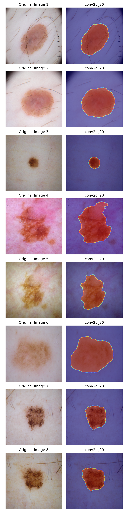

---

##### Observations

The Grad-CAM maps for the output layer align with the final binary segmentation outputs, as expected.

The model's output for images 1, 2, 7, and 8 aligns very closely with the expert annotation we saw earlier. 

Image 3 is exceptionally accurate, and clearly an optimal case for the Dice-Optimized model.

Image 6 is slightly oversegmented but shape alignment is strong, implying high semantic precision even if the exact boundary is slightly off. 

Images 4 & 5 are undersegmented, missing a portion of the lesion. Still the boundary decision is meaningfully aligned with the lesion for the most part. 

---

##### High-Level Insights
The Decision Path Visualization offers a full architectural audit trail, confirming the model's internal consistency. It does not guess. It builds its output step by step, preserving and refining relevant features as they move through the network. Misleading early activations are filtered out; class-relevant activations are preserved and amplified, especially after attention is applied.

This process shows that the model is internally coherent. It does not guess, it builds logically to its answer. Even in edge cases where its final decision does not exactly match the expert annotation, there is still signficant meaningful alignment. The segmentation boundary may be the correct shape but slightly larger, or the model makes the same segmentation decision as the expert annotation but fails to extend the boundary on one side far enough. The results are clear from visual inspection, metric calculations, and deeper investigation through XAI techniques. 

We learn the most from image 3, a small lesion, and 4 & 5, edge cases with large lesions. We confirm our model is behaving as expected, in the context of its specialization. It is optimized for cases like image 3 and not optimized for cases like images 4 and 5. 

Even in edge cases where its final decision does not exactly match the expert annotation, there is still signficant meaningful alignment. The segmentation boundary may be the correct shape but slightly larger, or the model makes the same segmentation decision as the expert annotation but fails to extend the boundary on one side far enough. 

To achieve more accurate segmentation for edge cases like images 4 & 5 we can compensate by using a differently specialized variant model, applying pre-processing to images prior to segmentation, or expanding training on edge case like these with focused expert annotation. 

This output isn't just a heatmap. It’s a transparent reasoning chain confirming that the model is performant, interpretable, and trustworthy. All required for integration into real-world, expert-aligned, high-stakes workflows.

---

### 6.6. Full XAI in Practice: Insights

In high-stakes fields like medical imaging, it is not sufficient for a model to simply “perform well.” Trustworthy & Ethical AI must also be interpretable, auditable, and aligned with human expertise. That’s why explainable AI (XAI) is central to this project’s design.

After using a suite of XAI tools to thoroughly evaluate Batch A, a representative batch including both optimal cases and sub-optimal cases for Model 1, we:

**- Validated** that the model's high performance metrics stem from real, interpretable decision-making, not statistical luck.
**- Confirmed** that even in edge cases where segmentation is not precise, the model consistently detects lesions.
**- Observed** that the model attends to and then disregards misleading features like hairs, shadows, and moles.
**- Correlated** confidence and prediction accuracy. The model is confident in its optimal decisions and less confident in sub-optimal decisions.
**- Verified** Model 1 performs exactly as designed, given its specialization (small to medium lesions).
**- Confirmed** the architecture's modular design works: clear separation of concerns and complementary contributions.
**- Identified** features of edge cases: large lesions with two distinct areas featuring different color and/or texture.
**- Derived** immediate, actionable steps: use a differently specialized variant model and/or apply targeted pre-processing for these edge cases.
**- Defined** future training priorities: expand expert annotations for edge-case lesion profiles.
**- Generated** rich, diagnostic insight for developers, evaluators, and domain experts to drive collaboration, HITL workflow integration, reglatory compliance, and iteration.

GlassBox XAI demonstrates a multi-layered approach to interpretability, combining complementary techniques that provide a clear, structured view into the model’s reasoning process:

- **Saliency Overlays (logits & sigmoid):** Show raw gradient-driven focus. What features the model reacts to most and also what it disregards for its final output.

- **Integrated Gradients Overlays:** Offer mathematically grounded attribution by measuring cumulative input-output relationships.

- **Superpixel Confidence Overlays:** Translate prediction probabilities into region-based clarity and uncertainty, crucial for HITL triage.

- **Decision Path Visualization via Layer-wise Grad-CAM:** Track the internal flow of relevance from input to output, highlighting what each architectural stage contributes.

---

#### Advantages Beyond "Black-Box" Models & Systems
GlassBox XAI demonstrates how explainability can be embedded into the architecture, not just tacked on after deployment. These tools work together to provide both broad coverage and fine-grained insight to support:

- **Edge Case Auditing**

- **Model Debugging**

- **Iterative Improvement**

- **Regulatory & Compliance Readiness**

- **Model Validation & Lifecycle Auditability**

- **Risk-aware Deployment**

- **Subject Matter Expert Collaboration**

- **Stakeholder Engagement**
 
- **Trust Calibration**

- **Human-in-the-Loop (HITL) Systems Integration**

---

#### Broader Applications
While this study focuses on lesion segmentation, the XAI methods demonstrated here generalize to any domain where decisions must be explained, verified, or defended:

- **Autonomous Driving:** Interpretable object boundary detection for safer decisions.

- **Industrial QA:** Explainable defect segmentation in high-throughput environments.

- **Environmental Monitoring:** Attribution-aware wildfire or oil spill detection from satellite data.

- **Defense & Security:** Sensible anomaly detection in high-stakes sensor feeds.

In each case XAI enables confidence, calibration, and accountability for safe AI adoption.

---

#### Final Takeaway
The models here do more than classify pixels. They also explains themselves, and their decisions, in detail. In safety-critical settings, that distinction matters. It’s what separates GlassBox XAI from high-performing, but opaque, black-box alternatives.

XAI systems like GlassBox XAI are: 

- **Transparent enough to trust.**

- **Auditable enough to deploy.**

- **Intelligent enough to improve.**

- **Specific enough to work with experts.**

This is how we move from high accuracy to high confidence and build the foundations for effective human-in-the-loop AI systems.

---

## 7. Data
This project uses the publicly available, anonymized dataset from ISIC 2018: Task 1 - Binary Segmentation, a globally recognized benchmark for skin lesion segmentation. See "Citations" section for direct links to the International Skin Image Collaboration (ISIC) website. 

- **High-Quality Curation:** The dataset was contributed by a consortium of international dermatology clinics and academic institutions. Images were collected under expert supervision, making it a clinically relevant and representative dataset.

- **Anonymized & PHI-Free:** All images are fully de-identified and publicly released under ISIC’s data use policy. No patient-identifiable information or Protected Health Information (PHI) is present in the dataset.

- **Dataset Composition:** ~2,600 images and their corresponding binary lesion masks. Includes a wide range of skin tones, lighting conditions, lesion types, and occlusions (e.g., hair, ruler marks).

- **Split Integrity Maintained:** The original Training, Validation, and Test splits were strictly preserved. No data leakage between splits. This ensures that reported performance can be directly compared to past and future solutions.

- **Testing & Metrics:** During evaluation, the models' predicted segmentation masks are directly compared to the ground truth segmentation masks created by domain experts. All reported metrics are computed from this pixel-level comparison on the official test set.

- **Relevance:** High performance on this benchmark, without pretrained models or external datasets, suggests strong model generalization and real-world potential, even under resource-constrained, on-device conditions. The ISIC dataset continues to serve as a standard in dermatological AI research, and results on this set remain a meaningful indicator of segmentation quality, clinical alignment, and benchmarking rigor.

---

## 8. Models & Metrics

---

### Architecture
GlassBox XAI uses a custom-built deep learning model based on U-Net, a specialized neural network architecture designed for precise image segmentation. Unlike conventional convolutional networks designed for image classification, U-Net is shaped like a “U” and learns to both understand the big picture and recover fine details. It is well-suited for pixel-wise delineation of lesion boundaries. 

To further improve accuracy, especially in challenging or noisy images, **attention mechanisms** were added. These help the model focus on the most relevant regions in the image, such as lesion edges, while ignoring background distractions like hair or shadows.

- All models use the same custom U-Net architecture with added attention mechanisms.
- Each was trained from scratch on only ISIC 2018 data, no pretrained models.
- Regularization techniques including layer normalization and dropout were applied to reduce overfitting.
- Each variant was trained and fine-tuned using different custom loss functions or hybrid functions, including: Dice Loss, Tversky Loss, and Dice-Tversky Loss.

---

### Model Performance Comparison

| Model        	 | Dice     | IoU      | Precision| Recall   |Pixel Accuracy | F1 Score |
|----------------|----------|----------|----------|----------|----------|----------|
| Dice-Optimized | **0.8751**   | **0.8000**   | **0.9028**   | 0.8291   | **0.9272**   | 0.8644   |
| Balance-Optimized | 0.8734   | 0.7925   | 0.8787   | 0.8564   | 0.9267   | **0.8674**   |
| Recall-Optimized | 0.8573   | 0.7669   | 0.8280   | **0.8936**   | 0.9182   | 0.8595   |

---

#### Why Optimize for Dice?
This model offers the strongest overall performance across key metrics. IoU tends to underrepresent performance on small structures due to their strict penalty on partial overlaps. Dice Coefficient was prioritized as the primary performance metric because it:
- Responds better to small object overlap
- Places less weight on boundary errors for large lesions
- Reflects clinical priorities: it’s better to detect a lesion imperfectly than to miss it entirely

---

#### Why Balance Recall - Precision?
This model prioritizes balancing false positives (over-detection) and false negatives (under-detection), achieving the highest F1 Score (harmonic mean of Precision and Recall). Suited for scenarios where over-detection and under-detection both carry risks. 

---

#### Why Optimize for Recall?
This model prioritizes minimizing false negatives to maximize sensitivity. It is designed to catch every possible lesion, erring on the side of over-detection. Suited for scenarios where missing lesion is unacceptable, even if it produces false positives.

---

## 9. Image Processing Pipeline
A pre-processing and augmentation pipeline was developed to support both training-time and test-time experimentation. This enabled flexible trials of various techniques to enhance robustness, generalization, and fairness. 

While final reported metrics are based solely on the unaltered test set (to preserve benchmark integrity), various pre-processing techniques were tested to evaluate their effect on generalization and robustness.

---

### Image-Mask Alignment
One of the key technical challenges in segmentation pipelines is ensuring perfect alignment between input images and their corresponding ground truth masks during data augmentation. Any mismatch, even a pixel shift, would corrupt the signal.

All geometric transformations (e.g., flipping, rotation, zoom) were applied using a shared random seed to ensure deterministic, mirrored changes to both images and masks. A post-transformation validation function was used during development to confirm correct alignment before training. Scripts were created to validate alignment before long training runs, which proved crucial for early-stage debugging.

---

### Modular Pipeline Design
The pipeline was built using a modular architecture, allowing toggling of transformations on or off, and setting boundaries (min/max intensity, rotation angles, etc.) from parameter inputs. This design enabled rapid iteration and testing.

---

### Photometric & Geometric Transformations
- Brightness
- Color Saturation
- Contrast
- Contrast Limited Adaptive Histogram Equalization (CLAHE)
- Dilation
- Edge Detection
- Erosion
- Gamma
- Gaussian Blur
- Gaussian Noise
- Horizontal Flip
- Hue Shift
- Rotation
- Vertical Flip
- Zoom

The final pipeline design prioritized reproducibility, modularity, and realism to enable efficient experimentation.

---

## 10. Key Development Milestones
These milestones reflect not only technical development but iterative experimentation, systematic validation, and a focus on real-world explainability.

---

### Problem Scoping & Constraints
- Defined potential clinical context, performance requirements, and XAI capabilities.
- Chose to exclude pretrained models and external datasets to enforce full transparency and auditability.
- Prioritized Dice Coefficient as the most clinically relevant metric.

---

### Data Review & Integrity
- Selected ISIC 2018 Challenge: Task 1 dataset for its clinical relevance and benchmark status.
- Maintained original training, validation, and test splits for reproducibility and fair comparison.

---

### Model Architecture Design
- Designed and initialized a custom U-Net model with attention mechanisms.
- Incorporated layer normalization, dropout, and other regularization strategies to reduce overfitting.

---

### Modular Augmentation Pipeline
- Developed a modular image processing pipeline supporting toggled transformations.
- Solved and validated image-mask alignment through shared random seeds and post-transform verification.
- Experimentation with transformations.

---

### Custom Loss Functions
- Implemented and compared Dice Loss, Tversky Loss, and a hybrid Dice–Tversky Loss to optimize for various clinical priorities.
- Aligned loss strategies with model variants.

---

### Initial Training
- Conducted initial training runs with aggressive logging, callbacks, and visualization.
- Verified base model performance using validation metrics prior to variant model fine-tuning.

---

### Variant Fine-Tuning
- Refined training parameters and loss functions for three model variants: Dice-Optimized, Balanced (F1), Recall-Optimized
- Tracked validation metrics to detect overfitting and guide early stopping.

---

### Evaluation & Benchmarking
- Computed all relevant performance metrics (Dice, IoU, Precision, Recall, Pixel Accuracy, F1 Score).
- Compared results across all three model variants.
- Used unaltered test set, no image preprocessing, for final benchmark reporting.

---

### Visualization & Verification
- Overlaid predicted segmentation masks on source images for visual inspection.
- Used this to detect potential post-processing errors.

---

### Preprocessing Experimentation
- Tested multiple preprocessing configurations and evaluated their impact on final test performance.
- Chose to report metrics without preprocessing to preserve direct comparability with other ISIC benchmark solutions.

---

### Explainability (XAI) Tools
- Solved the issue of model cloning and output layer adjustment for pre-sigmoid raw logit access.
- Added overlays and side-by-side views to improve interpretability.
- Tuned XAI tools to operate on either tensor or NumPy representations depending on compatibility.
- Implemented Grad-CAM, superpixel confidence mapping, saliency mapping, integrated gradients, and Grad-CAM layer visualizations.

---

### End to End Layer Visualization
- Created a function to visualize any layer, or combination of layers, using Grad-CAM.
- Enabled full layer-level inspection to observe architecture and confirm attention application.

---

### Demo
- Integrated all components into a polished, focused, reproducible demo and technical write-up suitable for review and presentation.

---

## 11. Future Work

GlassBox XAI has several avenues for improving model performance with tradeoffs in interpretability, development time, on-device feasibility, and computational cost. 

---

### Subject Matter Expert Collaboration
For GlassBox XAI to transition from proof-of-concept to clinical utility, collaboration with dermatology experts is essential.

- **Clinical Workflow Integration**
Partnering with dermatologists and clinical advisors can help validate real-world use cases, assess model performance in clinical settings, and identify opportunities for workflow integration and decision support.

- **UI/UX Development**
Building user interfaces tailored to clinical or educational use could improve usability for XAI visualizations. Integrating GlassBox XAI with clinical tools and EHR systems could further enhance its utility in real-world workflows.

- **Expanded XAI & Human-in-the-Loop (HITL) Tools**
Designing tools that allow experts to explore model reasoning, suggest corrections, and highlight edge cases could improve trust, enable targeted retraining, and accelerate model refinement through human-in-the-loop feedback.

---

### Performance Improvement
Improving Dice performance from 0.875 to 0.9 is feasible if we expand training data beyond the relatively small ISIC 2018 set and optimize data augmentation during training. 

Improvement beyond this is achievable as well, but would require more time and computational complexity. For example, an ensemble combining a high-performing Attention U-Net with architecturally diverse models could match the performance of 2025 state-of-the-art solutions while remaining relatively lightweight compared to transformer-based systems.

- **Optimize Data Augmentation**
More advanced or domain-specific augmentation strategies could improve generalization. This would require more experimentation and, ideally, domain expert collaboration.

- **Expand Training Data**
Incorporating more expert-annotated images from trusted sources (e.g., HAM10000) could improve model performance and reduce bias. This would be the most efficient way to improve metrics, and would have been prioritized in this iteration, but we constrained ourselves to using only the unaltered ISIC 2018 dataset for training.

- **Ensemble Models**
Combining the strengths of multiple models via ensembling or model averaging could improve overall performance, but increases inference time and complexity. While ensembling the three variant models in GlassBox XAI is technically possible, their shared architecture limits the diversity of learned representations, likely resulting in minimal gains. Greater benefits would be expected from ensembling architecturally diverse models.

- **Vision Transformers**
Transformer-based architectures have shown state-of-the-art performance in medical imaging tasks. Exploring these could improve segmentation performance. However, they generally require large-scale training data to outperform CNN-based models.

- **Pre-Trained Models**
Using pretrained encoders or models may accelerate convergence and improve performance, though it may reduce transparency and regulatory compliance if training data is not fully auditable. Additionally, most pretrained models require licensing agreements for full production deployment.

---

## 12. Tech Stack & Dependencies

This project was developed and executed in Jupyter Notebook using the following tools and libraries:

- Python - Core programming language
- Anaconda - Environment and dependency management
- Jupyter Notebook - Development and experimentation environment
- TensorFlow / Keras - Architecture, training, evaluation, metrics, pre-processing, Grad-CAM
- NumPy - Numerical operations, arrays, data handling
- Matplotlib / Seaborn - Data visualization
- Scikit-learn - Confusion matrices, metrics
- Scikit-image - Superpixel confidence mapping
- Albumentations / OpenCV / SciPy / SLIC - Image pre-processing, data augmentation, transformations
- Tqdm - Custom progress tracking
- ISIC 2018 Challenge Dataset - Benchmark dataset for training and evaluation

---

## 13. Citations
This project uses data from the ISIC 2018: Task 1 – Lesion Segmentation challenge. All images and masks are publicly available, de-identified, and used here under the ISIC data use policy for research and educational purposes.

---

### Dataset & Benchmark Challenges
[1] Noel Codella, Veronica Rotemberg, Philipp Tschandl, M. Emre Celebi, Stephen Dusza, David Gutman, Brian Helba, Aadi Kalloo, Konstantinos Liopyris, Michael Marchetti, Harald Kittler, Allan Halpern: "Skin Lesion Analysis Toward Melanoma Detection 2018: A Challenge Hosted by the International Skin Imaging Collaboration (ISIC)", 2018; https://arxiv.org/abs/1902.03368

[2] Tschandl, P., Rosendahl, C. & Kittler, H. The HAM10000 dataset, a large collection of multi-source dermatoscopic images of common pigmented skin lesions. Sci. Data 5, 180161 doi:10.1038/sdata.2018.161 (2018).

---

### Architecture & Model Design
[3] Ronneberger, O., Fischer, P., & Brox, T. (2015). U-Net: Convolutional Networks for Biomedical Image Segmentation.
https://arxiv.org/abs/1505.04597

[4] Oktay, O., et al. (2018). Attention U-Net: Learning Where to Look for the Pancreas.
https://arxiv.org/abs/1804.03999

---

### XAI & Integration
[5] Holzinger, A., et al. (2017). What do we need to build explainable AI systems for the medical domain?
https://arxiv.org/abs/1712.09923

[6] Tjoa, E., & Guan, C. (2021). A Survey on Explainable Artificial Intelligence (XAI): Toward Medical XAI. IEEE Transactions on Neural Networks and Learning Systems.
https://doi.org/10.1109/TNNLS.2020.3027314

[7] Rudin, C. (2019). Stop explaining black box machine learning models for high stakes decisions and use interpretable models instead. Nature Machine Intelligence.
https://doi.org/10.1038/s42256-019-0048-x

[8] Samek, W., Wiegand, T., & Müller, K.-R. (2017). Explainable Artificial Intelligence: Understanding, Visualizing and Interpreting Deep Learning Models.
https://arxiv.org/abs/1708.08296

---

### Segmentation Metrics
[9] Sudre, C. H., Li, W., Vercauteren, T., Ourselin, S., & Jorge Cardoso, M. (2017). Generalised Dice overlap as a deep learning loss function for highly unbalanced segmentations.
https://arxiv.org/abs/1707.03237

[10] Salehi, S. S. M., Erdogmus, D., & Gholipour, A. (2017). Tversky Loss Function for Image Segmentation Using 3D Fully Convolutional Deep Networks.
https://arxiv.org/abs/1706.05721

---

## 14. Author
**Jeffrey Robert Lynch** [LinkedIn](https://www.linkedin.com/in/jeffrey-lynch-350930348)

---

## 15. License

This project is for educational and demonstration purposes only. For commercial use, please contact the author.
