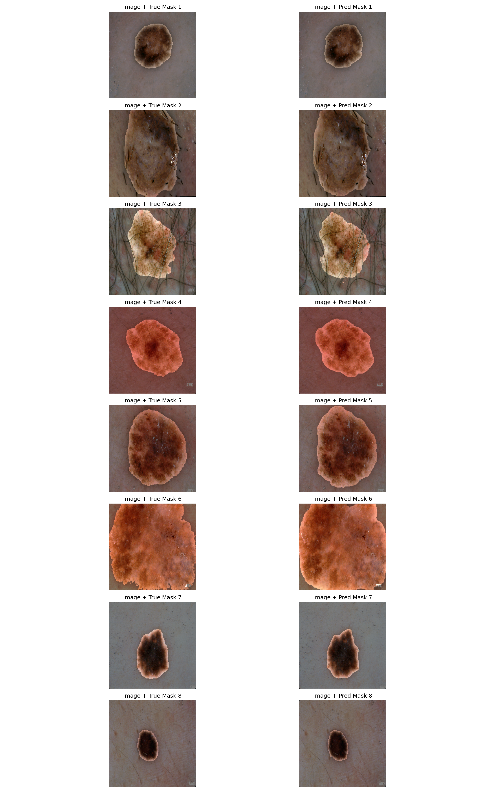
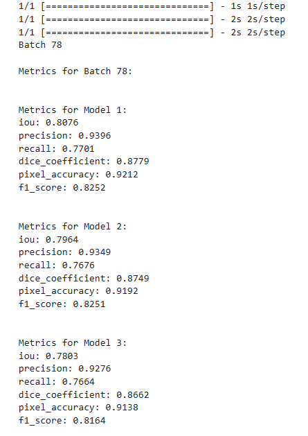
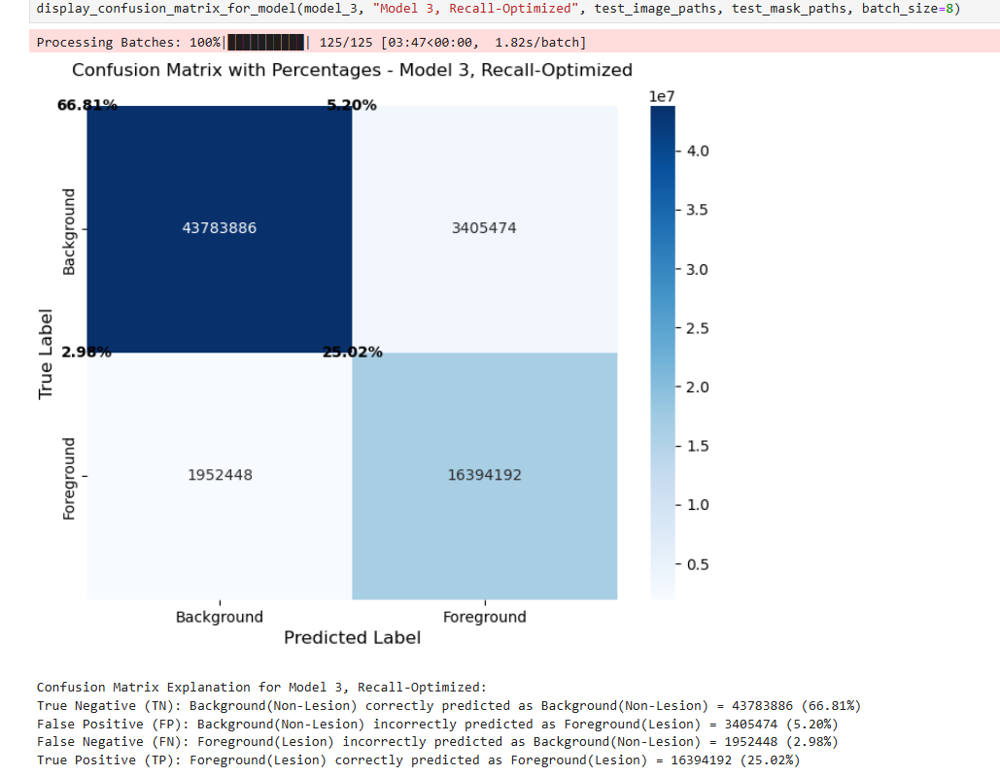

# GlassBox XAI
**GlassBox** is an AI system designed to support clinicians in interpreting medical images with **enhanced transparency**, **reliability**, and **auditability**. By combining **advanced deep learning** with a comprehensive suite of **explainable AI (XAI) techniques**, it highlights salient features in scans and surfaces model reasoning in an interpretable format. 

GlassBox uses an **Attention U-Net** architecture optimized for medical image segmentation, integrated with a real time **explainability layer** including **saliency maps**, **confidence overlays**, **integrated gradients**, and **layer-wise visualizations**. Inference is constructed wuth **visible**, **incremental output**, enabling effective **human-in-the-loop (HITL)** workflows and supporting **clinical review**.

This demo focuses on **binary skin lesion segmentation** using the **ISIC 2018 dataset**, GlassBox is designed as a **modular**, **domain-adaptable framework**. The **architecture**, **pipelines** (preprocessing, augmentation, training, evaluation), and **explainability layers** are designed for reusability across diverse segmentation tasks. Potential applications include **chest X-rays**, **retinal scans**, or **thoracic CT**, with **minimal adaptation**.

The pipelines are structured for **modular retraining** and **model interchangeability**, with explainability layers remaining **fully interoperable** across variants. This positions GlassBox not just as a proof of concept, but as a **scalable foundation for responsible AI deployment** in regulated, high-stakes environments.

This prototype reflects the capabilities achievable through independent development; **real-world deployment would require collaboration with clinical and regulatory experts**.

> Author’s note: The following work reflects independent development by an AI engineer trained in healthcare AI (Stanford AI in Healthcare specialization). This project is a research prototype, not a clinical device.

---

## Table of Contents
1. [Data Ethics & Full Disclaimer](#1-data-ethics--full-disclaimer)  
2. [Problem Domain](#2-problem-domain)  
3. [Solution Overview](#3-solution-overview)  
4. [Core Segmentation Features](#4-core-segmentation-features)  
    4.1. [Basic Segmentation Output](#41-basic-segmentation-output)  
    4.2. [Segmentation Overlay](#42-segmentation-overlay)  
5. [Comparative Model Evaluation](#5-comparative-model-evaluation)  
    5.1. [Variant Comparison Sementation Overlays – Batch A](#51-variant-comparison-segmentation-overlays--batch-a)  
    5.2. [Model Performance on Test Set](#52-model-performance-on-test-set)  
    5.3. [Confusion Matrices – Test Set](#53-confusion-matrices--test-set)  
6. [Interpretability & XAI](#6-interpretability--xai)  
    6.1. [Superpixel Confidence Overlay](#61-superpixel-confidence-overlay)  
    6.2. [Saliency Map](#62-saliency-map)  
    6.3. [Integrated Gradients Overlay](#64-integrated-gradients-overlay)  
    6.4. [Layer-wise Grad-CAM](#65-layer-wise-grad-cam)  
    6.5. [Full XAI in Practice: Insights](#66-full-xai-in-practice-insights)  
7. [Data](#7-data)  
8. [Models & Metrics](#8-models--metrics)  
9. [Image Processing Pipeline](#9-image-processing-pipeline)  
10. [Key Development Milestones](#10-key-development-milestones)  
11. [Future Work](#11-future-work)  
12. [Tech Stack & Dependencies](#12-tech-stack--dependencies)  
13. [Citations](#13-citations)  
14. [Author](#14-author)  
15. [License](#15-license)  

---

## 1. Data Ethics & Full Disclaimer

**This project is for research and demonstration purposes only. It is not a medical device and is not intended for clinical use, diagnosis, or treatment.**

**All medical images shown are sourced from the ISIC 2018 Challenge Dataset. A publicly released, fully anonymized dataset curated for non-commercial research. No private health information (PHI) is included.**

**All results and visual outputs are generated by deep learning models and evaluated using the official ISIC 2018 test set for accuracy metrics. This work has not been validated in clinical settings.**

**No claims are made regarding diagnostic accuracy, safety, or suitability for clinical deployment or decision support.**

**Visualizations (e.g., segmentation masks, XAI overlays, etc.) are interpretability tools designed to support human understanding of model behavior. They are not clinical indicators.**

> This work reflects a commitment to transparency, explainability, and responsible AI development in medical imaging and general XAI research. Please refer to the [ISIC 2018 dataset license and terms of use](https://challenge2018.isic-archive.com/) for attribution and usage guidelines.

---

## 2. Problem Domain
GlassBox addresses the challenge of **interpretable segmentation** in high-stakes domains using skin lesion analysis as a case study. Accurate **binary segmentation** is a foundational task in medical image analysis.

While black-box models can achieve high performance, they often lack **transparency**, **auditability**, and **alignment** with expert workflows. This gap makes them **unstuitable** for deployment in safety-critical settings. GlassBox explores how **explainable AI (XAI)** methods can be integrated directly into the segmentation pipeline to improve:

- **Feature visibility** for analysis.

- **Model transparency** through visual and quantitative inspection.

- **Human-in-the-loop (HITL)** compatibility for oversight and review.

This project does not address diagnosis. Its focus is bridging the gap between high-performing black-box segmentation models and **interpretable**, **auditable systems** that can support **responsible deployment**.

---

### 2.1. Why Explainability (XAI) is Critical in Healthcare AI
Transparency in model decisions is essential for the safe and ethical adoption of AI in healthcare. XAI supports:

- **Clinician Trust & Human Oversight:** Visual tools like saliency maps and Grad‑CAM help clinicians verify model reasoning at the pixel level, supporting HITL workflows and shared decision-making.

- **Regulatory & Ethical Compliance:** XAI enables audit trails, bias detection, and decision transparency increasingly required by medical regulators (e.g., FDA).

- **Model Debugging & Iterative Improvement** Visualizations expose model behavior under edge cases, guiding subject matter expert (SME) feedback and evaluation.

- **Real-World Utility:** Studies show interpretable tools are more likely to gain clinician trust for integration into expert workflows [(Holzinger et al., 2017)](https://arxiv.org/abs/1712.09923).

---

## 3. Solution Overview

### 3.1. Project Goals

- Develop a fully custom solution for **ISIC 2018: Task 1 – Binary Segmentation** with performance that matches or exceeds Dice: 0.875 and IoU: 0.8.
- Follow ISIC 2018 challenge dataset splits (Training, Validation, Test) for quantitative benchmarking.
- Impose constraints reflecting real-world low-infrastructure deployment environments:
  - **Local-only pipeline**: Train, test, and deploy entirely on-device to ensure **PHI security**.
  - **No pretrained models**: Enable **full model ownership**, traceability, and end-to-end auditability.
  - **No ensemble or high-cost methods**: Keep **resource demands low**, facilitating **deployment on modest hardware**.
  - **No cloud or external services**: Prevent data leakage and support **secure, private use cases**.
  - **ISIC 2018-only training data**: Reflects **real-world limitations** of curated, domain-specific datasets.
- Train **three specialized model variants** to explore trade-offs across **precision**, **recall**, and **balanced performance**.
- Integrate modular **XAI layers** to enhance **transparency**, **human-in-the-loop workflows**, and promote **regulatory readiness**.

---

### 3.2. Performance Metrics

Model performance is measured by comparing its predicted segmentations to expert-annotated ground truth masks from the test set. These test images were **not seen during training**, so they reveal how well the model can **generalize** to new, unseen cases. This is a key indicator of real-world utility.

Each metric captures a different aspect of segmentation quality:

- **Dice Coefficient:** Measures how well the predicted lesion area overlaps with the actual lesion. More tolerant of small boundary errors in large lesions but highly sensitive to errors in small lesions, where precision matters most. Favored in medical imaging because it aligns better with clinical priorities, where missing a small lesion can have greater consequences than imprecise edges on a large one.
- **Intersection over Union (IoU):** Similar to Dice but stricter. Penalizes all boundary mismatches equally, regardless of lesion size. Often used as a secondary reference metric.
- **Recall (Sensitivity):** Measures how well the model captures all true lesion areas. High recall reduces false negatives.
- **Precision:** Measures the proportion of predicted lesion area that is correct. High precision reduces false positives.
- **Global F1 Score:** The harmonic mean of precision and recall. Useful when both over-detection and under-detection carry risk.
- **Pixel Accuracy:** Shows the overall percentage of correctly labeled pixels. Can be misleading in medical imaging, where lesions often occupy only a small part of the image. For example, if just 10% of an image contains a lesion and the model misses it entirely, it still scores 90% accuracy.

**All metrics inform model performance, but Dice is emphasized due to its closer alignment with clinical relevance and its widespread use in medical image segmentation research.**

---

### 3.3. Variant Models

All three GlassBox models share the **same core architecture**, but were trained and fine-tuned with **different loss functions** (Dice, Tversky, Hybrid) to explore trade-offs for distinct clinical and deployment priorities:

- **Model 1 – Dice-Optimized:** Maxmizes overall segmentation overlap and Precision.
- **Model 2 – Balance-Optimized:** Seeks an even trade-off between false positives and false negatives.
- **Model 3 – Recall-Optimized:** Prioritizes Recall, minimizing false negatives.

---

### 3.4. Core Segmentation Features Preview

- **Binary Segmentation Output:** The raw model output. A binary mask showing which pixels the model identifies as lesion and which it identifies as non-lesion.
- **Segmentation Overlay:** Predicted mask, or boundary decision, dimmed and laid over the original image for segmentation. An essential step for evaluating segmentation accuracy.

---

### 3.5. Comparative Model Evaluation Features Preview

- **Variant Comparison Segmentation Overlays:** Side-by-side visual comparisons of all three model variants using the same image input. Highlights how each model handles boundary decisions differently based on specialization.
- **Test Set Performance Metrics:** Full evaluation across Dice, IoU, Precision, Recall, Pixel Accuracy, and Global F1 Score across all models.
- **Confusion Matrices:** Pixel-level false positive, false negative, true positive, and true negative rates for the entire test set across all models. High-level picture of strengths and trade-offs.

---

### 3.6. Interpretability & XAI Features Preview

- **Confidence Map Overlay:** Heatmap showing model confidence in its decisions across different regions of an image. Useful for spotting areas of uncertainty.
- **Saliency Map Overlay:** Highlights which pixels most strongly affect the model’s output. 
- **Integrated Gradients Overlay:** Measures cumulative influence of each pixel by comparing the image to a baseline blank image.
- **Grad-CAM Visualizations**: Displays activation heatmaps across encoder, bottleneck, and decoder layers. Reveals how segmentation decisions evolve through the network architecture.

---

### 3.7. Model Metrics

- The following results were obtained using the ISIC 2018 test set. Each model reflects a different optimization strategy as described above.

| Model              | Dice     | IoU      | Precision | Recall   | Pixel Accuracy | F1 Score |
|-------------------|----------|----------|-----------|----------|----------------|----------|
| **Dice-Optimized**   | **0.8751** | **0.8000** | **0.9028**  | 0.8291   | **0.9272**      | 0.8644   |
| **Balance-Optimized**| 0.8734   | 0.7925   | 0.8787    | 0.8564   | 0.9267         | **0.8674** |
| **Recall-Optimized** | 0.8573   | 0.7669   | 0.8280    | **0.8936** | 0.9182         | 0.8595   |

---

### 3.8. Solution Summary

GlassBox achieves **Dice 0.8751** and **IoU 0.8000**, reaching a strong performance tier **without relying on pretrained models, external data, or ensemble methods**. While some recent models (2024–2025) report Dice scores above 0.90, these rely on **compute-heavy models**, **expanded proprietary data**, or **non-trivial infrastructure**.

By contrast, GlassBox was built **entirely from scratch**, trained on **limited data**, and runs **securely on local hardware** with **full auditability and few dependencies**. This design supports **PHI privacy, traceability, and model ownership**.

This system demonstrates that **interpretable, performant AI solutions** can be developed and deployed under realistic constraints without sacrificing transparency or control. The trade-offs involved, and future development directions, are explored in the **Future Work** section.

---

## 4. Core Segmentation Features

The visuals below demonstrate the core segmentation capabilities of GlassBox. While all features support all model variants and image batches, this walkthrough primarily focuses on **Model 1 (Dice-Optimized)** using **Batch A (Average Performance)** for clarity, consistency, and realistic baseline performance.

- **Batch A (Average Metrics):** Mirrors the models' average performance on the full test set. Represent typical, expected outcomes. Contains some challenging edge case images.
- **Batch B (High Metrics):** Outperforms average metrics. Highlights optimal use cases. Contains no edge case images.
- **Batch C (Low Metrics):** Underperforms average metrics. Contains many edge case images.

---

### 4.1. Basic Segmentation Output

This section demonstrates how raw model predictions are turned into clear, interpretable visuals. The core output is a **binary segmentation mask**, highlighting lesion regions on a per-pixel basis. Here we have the base image to be segmented, the expert annotated mask, and the models' outputted mask for comparison. 

Ground truth masks, expert-annotated and included for evaluation, allow us to compare model output visually and calculate performance metrics across the batch. 

---

#### Basic Segmentation Output - Model 1 - Batch A

---

---

### 4.2. Segmentation Overlay

To make predictions visually intuitive, we overlay the **dimmed segmentation mask** onto the **original input image**. This creates a **human-readable output** that can be compared directly with expert annotations. We include overlays for both the model and expert masks, along with batch-level performance metrics for context.

---

#### Segmentation Overlay - Model 1 - Batch A
This visual uses **Batch A**, representing expected mean performance. The model's segmentation boundaries align closely with the expert-annotated boundaries, aside from images 4 and 5, which are aligned but undersegmented. Image 6 is slightly oversegmented, but still shows accurate shape alignment. 

---

---

---

#### Segmentation Overlay - Model 1 - Batch B
This visual uses **Batch B**, representing optimal use case. The model's segmentation boundaries very closely mirror the expert-annotated boundaries. Slight misalignment in images 3, 5, and 6.

---

---

---

#### Segmentation Overlay - Model 1 - Batch C
This visual uses **Batch C**, representing edge cases and failure points. The model's segmentation boundaries align relatively closely with the expert-annotated boundaries for images 6, 7, and 8. However, the model is missing portions of the lesion in images 1, 2, 3, 4 and 5.

---

---

---

## 5. Comparative Model Evaluation
Building trust in AI systems requires more than clean outputs; it requires **objective, transparent evaluation**. This section compares the performance of three variant models to show how different training strategies affect generalization and error profiles.

---

### 5.1. Variant Comparison Segmentation Overlays - All Models - Batch A
Here we visualize the segmentation decisions of all three variant models for comparison. While overall performance is similar, subtle differences in boundaries are present.

---

---

---

### 5.2. Model Performance Evaluation on Test Set - All Models - Test Set
All three models achieve strong overall performance on the held-out test set. However, their error patterns differ meaningfully. The clearest differentiator is how each model balances Precision and Recall, or the rate of false positives versus false negatives at the pixel level.

---

#### Model 1 - Dice-Optimized
Precision is higher; Recall is lower.

---

---

#### Model 2 - Balance-Optimized

Precision and Recall are balanced.

---

---

#### Model 3 - Recall-Optimized

Precision is lower; Recall is higher.

---

---

### 5.3. Confusion Matrices - All Models - Test Set

Confusion matrices break down correct and incorrect predictions on a per-pixel basis across the entire test set. This provides a more detailed view of where and how errors occur, especially for medical applications where every pixel may carry diagnostic weight.

These matrices reveal a consistent pattern across models: as false positives increase, false negatives decrease, and vice versa. This does not indicate a drop in overall performance, each model remains highly accurate. Rather, it reflects intentional optimization for different risk profiles and deployment scenarios achieved through different custom loss functions. 

False positives are more acceptable than false negatives if missing a condition, or part of a condition, could lead to serious consequences. In other contexts, such as when treatment carries significant risk or the condition is less severe, a higher false negative rate may be tolerable. Alternatively, we can aim for balance. These preferences can also be fine-tuned more granularly through thresholding and curve analysis to further specialize model behavior.

---

#### Model 1 - Dice-Optimized
~2.5% of test pixels are false positives; ~4.8% are false negatives. 

---

---

#### Model 2 - Balance-Optimized 
~3.3% of test pixels are false positives; ~4.0% are false negatives.

---

---

#### Model 3 - Recall-Optimized 
~5.2% of test pixels are false positives; ~3.0% are false negatives. 

---

---

## 6. Interpretability & XAI
Understanding how and why a model makes its predictions is essential for trust, regulatory compliance, clinical safety, and real-world deployment.

This section introduces a suite of interpretability tools designed to explain and validate model behavior beyond standard metrics. 

- **Superpixel Confidence Overlay**: Shows where the model is more or less confident.

- **Saliency Overlay**: Highlights influential pixels.

- **Integrated Gradients Overlay**: Attributes pixel influence relative to a baseline.

- **Layer-wise Grad-CAM**: Visualizes layer-wise activations through the network.

These tools help answer key questions:

- Did it focus on non-lesion features (e.g, hairs, moles, shadows) but correctly not include them in output?

- Is confidence highest where we expect it, in lesion centers, and lowering near boundaries?

- Does the model show uncertainty near errors, or make confident mistakes?

- Do attention mechanisms highlight relevant regions as intended?

Whether auditing edge cases, supporting human-in-the-loop workflows, or ensuring regulatory readiness, **XAI is foundational**.

We continue with Batch A for examples, highlighting differences between well-segmented images and those with under-segmentation or over-segmentation.

---

### 6.1. Superpixel Confidence Overlay

This visualization overlays the segmentation mask with a superpixel-based heatmap of per-pixel confidence. Each region is color-coded based on how confidently the model believes it is part of the lesion.
---

#### What This Tells Us

- **Deep red:** Very high confidence. Typically in core lesion area.

- **Orange-yellow-green:** Decreasing confidence, often near boundaries.

- **Clear blue background:** High confidence that this area is not part of the lesion. 

---

#### Potential Value

- Highlights **uncertainty areas** for manual review.

- Supports **HITL workflows** by indicating model confidence at a fine-grained level.

- Useful for identifying the **specific features** of edge cases.

- Confirm expected behavior; **high confidence in lesion center** with reduced confidence along boundaries.

---

#### Superpixel Confidence Overlay - Batch A

---

#### Observations

Images 4 and 5 show notable boundary uncertainty, aligning with earlier undersegmentation. Image 6 shows slightly higher uncertainty in the outer boundary, consistent with its slight oversementation.

---

#### Disclaimer
This system is for research and educational use only. Visuals and insights are based on the ISIC 2018 dataset and are not clinically validated.

---

### 6.2. Saliency Map Overlay

This visualization highlights regions where the model’s output is most sensitive to small changes in the input. Each pixel is colored based on the gradient magnitude of the raw logits (pre-sigmoid output) with respect to the input image.

The result is a high-resolution sensitivity map that reveals where the model is paying attention, whether the fsture focused on becomes part of the final output or not.

---

#### What This Tells Us

- Hot pixels indicate regions with strong influence on the model’s raw output.

- Edges and texture patterns often light up, especially around lesion boundaries.

- Non-lesion signals (e.g., hairs, shadows) also appear, even if they don’t affect the final prediction.

---

#### Potential Value

- Reveals broad input sensitivity, including irrelevant or misleading features.

- Useful for debugging early-stage models or assessing dataset quality.

- Helps evaluate whether the model attends to meaningful visual signals, or just reacts broadly.

---

#### Saliency Map Overlay - Raw Logits - Model 1 - Batch A

---

#### Observations

Hotspots typically align with lesion boundaries, but also appear around irrelevant features like hairs or shadows. This suggests that the model reacts broadly, but does not necessarily rely on all signals for its final prediction.

Images 4, 5, and 6, where segmentation was weaker, show more diffuse, noisy saliency patterns. This may reflect uncertainty or poor feature alignment.

---

#### Disclaimer
For research and educational use only. Visuals and insights are based on the ISIC 2018 dataset and are not clinically validated.

---

### 6.3. Integrated Gradients Overlay

This heatmap shows which pixels most influenced the model’s final segmentation, computed by comparing a blank baseline to the actual input. Integrated Gradients emphasize causal contributions to a segmentation decision. Not everything the model notices, like saliency, but only what it acts on.

---

#### What This Tells Us
- **Bright, saturated regions:** These pixels consistently contributed to the model’s prediction as the image was progressively revealed and should correspond to the lesion.

- **Dark or desaturated regions:** These pixels had little to no effect on the model’s decision. 

---

#### Potential Value

- Highlights causal contributions instead of just attention or sensitivity, supporting model explainability during audits.

- Reveals what drove the prediction, not just what triggered sensitivity.

- Valuable in conjunction with saliency to see early stage activation and what is filtered out in intermediate stages.

---

#### Integrated Gradients Overlay - Model 1 - Batch A

---

#### Observations

Most images are remarkably consistent here. High-importance regions (green/yellow clusters) largely coincide with lesion boundaries and internal texture, even in difficult cases. For example, Image 3 shows a tight, centralized attribution corresponding precisely to a small lesion. Images 1, 2, 7, and 8 also show well-localized attribution consistent with lesion contours. Image 6 exhibits broader but clear attribution, aligning with its mild oversegmentation but precise shape. 

Image 4 is diffuse and a clear outlier, however. Most likely due to the presence of two clearly different colors in one lesion. An edge case that can be understood and addressed. 

---

#### Disclaimer
This visualization is for research and educational purposes only. Visuals and insights are based on the ISIC 2018 dataset and are not clinically validated.

---

### 6.4. Decision Path Visualization via Layer-wise Grad-CAM
This technique shows how different parts of an image influence the model’s prediction across its entire architecture. At each stage we apply Grad-CAM to visualize what the model is focusing on at every layer.

These class activation maps reveal how early features evolve into final segmentation decisions.

---

#### What This Tells Us
- **Warm Regions:** Areas of strong positive activation for the lesion class.

- **Cool Regions:** Areas of low activation.

- **Early layers**: Focus on texture and features.

- **Later layers**: Sharpen around lesion boundaries and shape.

---

#### Potential Value

- **End-to-end** interpretability of model behavior.

- **Auditability** Track how errors or edge cases emerge during processing. 

- **Trust calibration** by confirming that focus aligns with relevant features.

- **Granular model analysis** supports architecture refinement by showing unstable layers.

---

#### Disclaimer
These visualizations are for research and educational purposes only. Visuals and insights are based on the ISIC 2018 dataset and are not clinically validated.

---

#### Layer-wise Grad-CAM - Encoder Layers - Model 1 - Batch A

This first set of heatmaps shows Grad-CAM activations at successive convolutional layers within the encoder layers. The encoder extracts progressively abstract features from the raw input.

---

---

##### Observations

The activations for images 1 and 2 are primarily related to hairs and shadows, misleading artifacts. However, both images will ultimately be well-segmented; these features did not contribute to the final output.

Image 3 demonstrates that the encoder handles small, well-defined lesions with high confidence and precision. This is expected, as Model 1 is optimized for Dice performance. It was penalized more for making mistakes on small lesions rather than large lesions. This aligns with our goals for this model. It is unlikely to miss any lesion, whether large or small. However, its segmentation borders for larger lesions may be less precise. This also may explain the undersegmentation in Images 4 and 5, which feature larger lesions.

---

#### Decision Path Visualization via Layer-wise Grad-CAM - Attention Bottleneck Layers - Model 1 - Batch A

The encoder's abstracted features are passed forward. Attention is applied here, at the bottleneck, selectively filtering what information gets passed along to the decoder for reconstruction.

Activations should be tighter and more class-specific than the encoder. Attention gating should emphasize lesion areas while downplaying background. Ideally, this will correct cases where the encoder under or over attended to features before they are passed to the decoder layers for reconstruction.

---

##### Observations
Strong consistency across all 8 images. Lesion regions are clearly activated and surrounding skin, hairs, and background are clearly suppressed. This shows effective attention gating that will be seen even more clearly in the decoder layers. 

Image 3 is clearly an optimal case, as expected. This aligns with the confidence metrics we saw in the Superpixel Confidence Overlay earlier for this image. 

Images 1, 2, 6, 7, and 8 also show clear, dense activation aligned with the final boundary decision. 

Both images 4 and 5 contain two lesion areas that are of different and contrasting color. The model picks up much of the differently colored region, away from the core, but does not capture all of it. We have identified a possible consistent feature with these 2 edge cases. 

---

#### Decision Path Visualization via Layer-wise Grad-CAM - Decoder Layers - Model 1 - Batch A

The decoder’s job is to construct the segmentation mask. The decoder combines spatial details with high-level features to reconstruct the segmentation.

This is where we expect the clearest signs that attention worked. If attention succeeded in isolating lesion-relevant features, the decoder should now reassemble them into a precise and well-aligned segmentation boundary. We should see gradually increasing clarity as we move from early layers to later layers. 

---

##### Observations

All images show strong focus on lesion regions across decoder stages. Compared to earlier layers, the lesion boundaries here are sharp and complete.

Images 1, 2, 6, 7, and 8 are fully reconstructed with tight boundary fit. 

Image 3 has clear and compact focus throughout. 

Images 4 & 5 become increasingly defined, with meaningful boundaries, but boundary detail is slightly underexpressed. 

---

#### Decision Path Visualization via Layer-wise Grad-CAM - Final Layer with Output - Model 1 - Batch A

In this final stage, we examine the Grad-CAM heatmaps for the output layer, which produces the segmentation mask via pixel-wise classification. The output layer applies a sigmoid activation function to generate a probability map. Each pixel gets a confidence score between 0 and 1 for belonging to the lesion class. This output is thresholded, at 0.5 for baseline, to create a binary segmentation mask.

This is the culmination of the encoder’s feature extraction, the attention bottleneck’s filtering, and the decoder’s reconstruction. The output layer reflects the model’s final decision. 

---

##### Observations

The model's output for images 1, 2, 7, and 8 aligns very closely with the expert annotation we saw earlier. 

Image 3 is exceptionally accurate, and clearly an optimal case for the Dice-Optimized model.

Image 6 is slightly oversegmented but shape alignment is strong, implying high semantic precision even if the exact boundary is slightly off. 

Images 4 & 5 are undersegmented, missing a portion of the lesion. Still the boundary decision is meaningfully aligned with the lesion for the most part. 

---

##### High-Level Insights
Layer-wise grad-CAM offers a full architectural audit trail, confirming the model's internal consistency. It does not guess. It builds its output step by step, preserving and refining relevant features as they move through the network. Misleading early activations are filtered out; class-relevant activations are preserved and amplified, especially after attention is applied.

We learn the most from image 3, a small lesion, and 4 & 5, edge cases with large lesions. We confirm our model is behaving as expected, in the context of its specialization. It is optimized for cases like image 3 and not optimized for cases like images 4 and 5. 

Even in edge cases where the final output diverges from expert annotations, alignment remains strong. The model often captures the correct shape but may slightly under- or over-extend boundaries.

To achieve more accurate segmentation for edge cases like images 4 & 5 we can compensate by using a differently specialized variant model, applying pre-processing to images prior to segmentation, or expanding training on edge cases like these with focused expert annotation. 

This output isn't just a heatmap. It’s a transparent reasoning chain confirming that the model is performant, interpretable, and trustworthy. 

---

### 6.5. Full XAI in Practice

In high-stakes fields like medical imaging, it is not sufficient for a model to simply “perform well" in metrics. Trustworthy & Ethical AI must also be interpretable, auditable, and aligned with human expertise. That’s why explainable AI (XAI) is central to this project’s design.

After using a suite of XAI tools to thoroughly evaluate Batch A, a representative batch including both optimal cases and sub-optimal cases for Model 1, we:

**- Validated** that the model's high performance metrics stem from real, interpretable decision-making.
**- Confirmed** that even in edge cases where segmentation is not precise, the model consistently detects lesions.
**- Observed** that the model attends to and then disregards misleading features like hairs, shadows, and moles.
**- Correlated** confidence and prediction accuracy. The model is confident in its optimal decisions and less confident in sub-optimal decisions.
**- Verified** Model 1 performs as designed, given its specialization.
**- Confirmed** the architecture's modular design works: clear separation of concerns and complementary contributions.
**- Identified** features of edge cases: large lesions with two distinct areas featuring different color and/or texture.
**- Defined** actionable steps for improvementl retrain on identified edge cases and/or apply targeted pre-processing for these edge cases.
**- Generated** rich, diagnostic insight for developers, evaluators, and domain experts to drive collaboration, HITL workflow integration, reglatory compliance, and iteration.

GlassBox demonstrates a multi-layered approach to interpretability, combining complementary techniques that provide a clear, structured view into the model’s reasoning process:

- **Saliency Overlays:** Show raw gradient-driven focus. What features the model reacts to most and also what it disregards for its final output.

- **Integrated Gradients Overlays:** Offer mathematically grounded attribution by measuring cumulative input-output relationships.

- **Superpixel Confidence Overlays:** Translate prediction probabilities into region-based clarity and uncertainty.

- **Decision Path Visualization via Layer-wise Grad-CAM:** Track the internal flow from input to output, highlighting what each architectural stage contributes.

---

#### Advantages Beyond "Black-Box" Models & Systems
GlassBox demonstrates how explainability can be embedded into the architecture, not just tacked on after deployment. These tools work together to provide both broad coverage and fine-grained insight to support:

- **Edge Case Auditing**

- **Model Debugging**

- **Iterative Improvement**

- **Regulatory & Compliance Readiness**

- **Model Validation & Lifecycle Auditability**

- **Risk-aware Deployment**

- **Subject Matter Expert Collaboration**

- **Stakeholder Engagement**
 
- **Trust Calibration**

- **Human-in-the-Loop (HITL) Systems Integration**

---

#### Broader Applications
While this study focuses on lesion segmentation, the XAI methods demonstrated here generalize to any domain where decisions must be explained, verified, or defended:

- **Autonomous Driving:** Interpretable object boundary detection for safer decisions.

- **Industrial QA:** Explainable defect segmentation in high-throughput environments.

- **Environmental Monitoring:** Attribution-aware wildfire or oil spill detection from satellite data.

- **Defense & Security:** Sensible anomaly detection in high-stakes sensor feeds.

In each case XAI enables confidence, calibration, and accountability for safe AI adoption.

---

#### Final Takeaway
The models here do more than classify pixels. They also explains themselves, and their decisions, in detail. In safety-critical settings, that distinction matters. It’s what separates GlassBox from high-performing, but opaque, black-box alternatives. Even high performing models should be subject to outside review.

XAI systems like GlassBox are: 

- **Transparent enough to trust.**

- **Auditable enough to deploy.**

- **Modular enough to improve.**

- **Specific enough to work with experts.**

This is how we move from high accuracy to high confidence and build the foundations for effective human-in-the-loop AI systems.

---

## 7. Data
This project uses the publicly available, anonymized dataset from ISIC 2018: Task 1 - Binary Segmentation, a globally recognized benchmark for skin lesion segmentation. See "Citations" section for direct links to the International Skin Image Collaboration (ISIC) website. 

- **High-Quality Curation:** The dataset was contributed by a consortium of international dermatology clinics and academic institutions. Images were collected under expert supervision, making it a clinically relevant and representative dataset.

- **Anonymized & PHI-Free:** All images are fully de-identified and publicly released under ISIC’s data use policy. No patient-identifiable information or Protected Health Information (PHI) is present in the dataset.

- **Dataset Composition:** ~2,600 images and their corresponding binary lesion masks. Includes a wide range of skin tones, lighting conditions, lesion types, and occlusions (e.g., hair, ruler marks).

- **Split Integrity Maintained:** The original Training, Validation, and Test splits were strictly preserved. No data leakage between splits. This ensures that reported performance can be directly compared to past and future solutions.

- **Testing & Metrics:** During evaluation, the models' predicted segmentation masks are directly compared to the ground truth segmentation masks created by domain experts. Reported metrics are computed from this pixel-level comparison on the official test set. Dice and IoU are calculated by averaging per image metrics across the set. Precicision, Recall, and Global F1 are calculated by pixel error across every image in the test set.

- **Relevance:** High performance on this benchmark, without pretrained models or external datasets, suggests strong model generalization and real-world potential, even under resource-constrained, on-device conditions. The ISIC dataset continues to serve as a standard in dermatological AI research, and results on this set remain a meaningful indicator of segmentation quality, clinical alignment, and benchmarking rigor.

---

## 8. Models & Metrics

---

### Architecture
GlassBox uses a custom-built deep learning model based on U-Net, a specialized neural network architecture designed for precise image segmentation. Unlike conventional convolutional networks designed for image classification, U-Net is shaped like a “U” and learns to both understand the big picture and recover fine details. It is well-suited for pixel-wise delineation of lesion boundaries. 

To further improve accuracy, especially in challenging or noisy images, **attention mechanisms** were added. These help the model focus on the most relevant regions in the image, such as lesion edges, while ignoring background distractions like hair or shadows.

- All models use the same custom U-Net architecture with added attention mechanisms.
- Each was trained from scratch on only ISIC 2018 data, no pretrained models.
- Regularization techniques including layer normalization and dropout were applied to reduce overfitting.
- Each variant was trained and fine-tuned using different custom loss functions or hybrid functions, including: Dice Loss, Tversky Loss, and Hybrid Dice-Tversky Loss.

---

### Model Performance Comparison

| Model        	 | Dice     | IoU      | Precision| Recall   |Pixel Accuracy | F1 Score |
|----------------|----------|----------|----------|----------|----------|----------|
| Dice-Optimized | **0.8751**   | **0.8000**   | **0.9028**   | 0.8291   | **0.9272**   | 0.8644   |
| Balance-Optimized | 0.8734   | 0.7925   | 0.8787   | 0.8564   | 0.9267   | **0.8674**   |
| Recall-Optimized | 0.8573   | 0.7669   | 0.8280   | **0.8936**   | 0.9182   | 0.8595   |

---

#### Why Optimize for Dice?
This model offers the strongest overall performance across key metrics. IoU tends to underrepresent performance on small structures due to their strict penalty on partial overlaps. Dice Coefficient was prioritized as the primary performance metric because it:
- Responds better to small object overlap
- Places less weight on boundary errors for large lesions
- Reflects clinical priorities: it’s better to detect a lesion imperfectly than to miss it entirely

---

#### Why Balance Recall - Precision?
This model prioritizes balancing false positives (over-detection) and false negatives (under-detection), achieving the highest Global F1 Score (harmonic mean of Precision and Recall). Suited for scenarios where over-detection and under-detection both carry risks. 

---

#### Why Optimize for Recall?
This model prioritizes minimizing false negatives to maximize sensitivity. It is designed to catch every possible lesion, erring on the side of over-detection. Suited for scenarios where missing lesion is unacceptable, even if it produces false positives.

---

## 9. Image Processing Pipeline
A pre-processing and augmentation pipeline was developed to support both training-time and test-time experimentation. This enabled flexible trials of various techniques to enhance robustness, generalization, and fairness. 

While final reported metrics are based solely on the unaltered test set (to preserve benchmark integrity), various pre-processing techniques were tested to evaluate their effect on generalization and robustness.

---

### Image-Mask Alignment
One of the key technical challenges in segmentation pipelines is ensuring perfect alignment between input images and their corresponding ground truth masks during data augmentation. Any mismatch, even a pixel shift, would corrupt the signal.

All geometric transformations (e.g., flipping, rotation, zoom) were applied using a shared random seed to ensure deterministic, mirrored changes to both images and masks. A post-transformation validation function was used during development to confirm correct alignment before training. Scripts were created to validate alignment before long training runs, which proved crucial for early-stage debugging.

---

### Modular Pipeline Design
The pipeline was built using a modular architecture, allowing toggling of transformations on or off, and setting boundaries (min/max intensity, rotation angles, etc.) from parameter inputs. This design enabled rapid iteration and testing.

---

### Photometric & Geometric Transformations
- Brightness
- Color Saturation
- Contrast
- Contrast Limited Adaptive Histogram Equalization (CLAHE)
- Dilation
- Edge Detection
- Erosion
- Gamma
- Gaussian Blur
- Gaussian Noise
- Horizontal Flip
- Hue Shift
- Rotation
- Vertical Flip
- Zoom

The final pipeline design prioritized reproducibility, modularity, and realism to enable efficient experimentation.

---

## 10. Key Development Milestones
These milestones reflect not only technical development but iterative experimentation, systematic validation, and a focus on real-world explainability.

---

### Problem Scoping & Constraints
- Defined potential clinical context, performance requirements, and XAI capabilities.
- Chose to exclude pretrained models and external datasets to enforce full transparency and auditability.
- Prioritized Dice Coefficient as the most clinically relevant metric.

---

### Data Review & Integrity
- Selected ISIC 2018 Challenge: Task 1 dataset for its clinical relevance and benchmark status.
- Maintained original training, validation, and test splits for reproducibility and fair comparison.

---

### Model Architecture Design
- Designed and initialized a custom U-Net model with attention mechanisms.
- Incorporated layer normalization, dropout, and other regularization strategies to reduce overfitting.

---

### Modular Augmentation Pipeline
- Developed a modular image processing pipeline supporting toggled transformations.
- Solved and validated image-mask alignment through shared random seeds and post-transform verification.
- Experimentation with transformations.

---

### Custom Loss Functions
- Implemented and compared Dice Loss, Tversky Loss, and a hybrid Dice–Tversky Loss to optimize for various clinical priorities.
- Aligned loss strategies with model variants.

---

### Initial Training
- Conducted initial training runs with aggressive logging, callbacks, and visualization.
- Verified base model performance using validation metrics prior to variant model fine-tuning.

---

### Variant Fine-Tuning
- Refined training parameters and loss functions for three model variants: Dice-Optimized, Balanced (F1), Recall-Optimized
- Tracked validation metrics to detect overfitting and guide early stopping.

---

### Evaluation & Benchmarking
- Computed all relevant performance metrics (Dice, IoU, Precision, Recall, Pixel Accuracy, F1 Score).
- Compared results across all three model variants.
- Used unaltered test set, no image preprocessing, for final benchmark reporting.

---

### Visualization & Verification
- Overlaid predicted segmentation masks on source images for visual inspection.
- Used this to detect potential post-processing errors.

---

### Preprocessing Experimentation
- Tested multiple preprocessing configurations and evaluated their impact on final test performance.
- Chose to report metrics without preprocessing to preserve direct comparability with other ISIC benchmark solutions.

---

### Explainability (XAI) Tools
- Solved the issue of model cloning and output layer adjustment for pre-sigmoid raw logit access.
- Added overlays and side-by-side views to improve interpretability.
- Tuned XAI tools to operate on either tensor or NumPy representations depending on compatibility.
- Implemented Grad-CAM, superpixel confidence mapping, saliency mapping, integrated gradients, and Grad-CAM layer visualizations.

---

### End to End Layer Visualization
- Created a function to visualize any layer, or combination of layers, using Grad-CAM.
- Enabled full layer-level inspection to observe architecture and confirm attention application.

---

### Demo
- Integrated all components into a polished, focused, reproducible demo notebook and technical write-up suitable for review and presentation.
- Recorded concise technical demo featuring live execution.

---

## 11. Future Work

GlassBox has several avenues for improving model performance with tradeoffs in interpretability, development time, on-device feasibility, and computational cost. 

---

### Subject Matter Expert Collaboration
For GlassBox to transition from proof-of-concept to clinical utility, collaboration with dermatology experts is essential.

- **Clinical Workflow Integration**
Partnering with dermatologists and clinical advisors can help validate the utility of XAI techniques in clinical settings, identify opportunities for workflow integration, and prioritize additional techniques for decision support.

- **UI/UX Development**
Building user interfaces tailored to clinical or educational use could improve usability for XAI visualizations. Integrating GlassBox with clinical tools and EHR systems could further enhance its utility in real-world workflows.

- **Expanded XAI & Human-in-the-Loop (HITL) Tools**
Designing additional tools that allow experts to explore model reasoning, suggest corrections, and highlight edge cases could improve trust, enable targeted retraining, and accelerate model refinement through human-in-the-loop feedback.

---

### Performance Improvement
Improving Dice performance from 0.875 to 0.9 is feasible if we expand training data beyond the relatively small ISIC 2018 set and optimize data augmentation during training. 

Improvement beyond this is achievable as well, but would require more time and computational complexity. For example, an ensemble combining a high-performing Attention U-Net with architecturally diverse models could match the performance of 2025 state-of-the-art solutions.

- **Optimize Data Augmentation**
More advanced or domain-specific augmentation strategies could improve generalization. This would require more experimentation and domain expert collaboration.

- **Expand Training Data**
Incorporating more expert-annotated images from trusted sources (e.g., HAM10000) could improve model performance and reduce bias. This would be the most efficient way to improve metrics, and would have been prioritized in this iteration, but we constrained ourselves to using only the unaltered ISIC 2018 dataset for training.

- **Ensemble Models**
Combining the strengths of multiple models via ensembling or model averaging could improve overall performance, but increases inference time and complexity. While ensembling the three variant models in GlassBox is technically possible, their shared architecture limits the diversity of learned representations, likely resulting in minimal gains. Greater benefits would be expected from ensembling architecturally diverse models.

- **Vision Transformers**
Transformer-based architectures have shown state-of-the-art performance in medical imaging tasks. Exploring these could improve segmentation performance. However, they generally require large-scale training data and increased computational complexity.

- **Pre-Trained Models**
Using pretrained encoders or models may accelerate convergence and improve performance, though it may reduce transparency and regulatory compliance if training data is not fully auditable. Additionally, most pretrained models require licensing agreements for full production deployment.

---

## 12. Tech Stack & Dependencies

This project was developed and executed in Jupyter Notebook using the following tools and libraries:

- Python - Core programming language
- Anaconda - Environment and dependency management
- Jupyter Notebook - Development and experimentation environment
- TensorFlow / Keras - Architecture, training, evaluation, metrics, pre-processing, Grad-CAM
- NumPy - Numerical operations, arrays, data handling
- Matplotlib / Seaborn - Data visualization
- Scikit-learn - Confusion matrices, metrics
- Scikit-image - Superpixel confidence mapping
- Albumentations / OpenCV / SciPy / SLIC - Image pre-processing, data augmentation, transformations
- Tqdm - Custom progress tracking
- ISIC 2018 Challenge Dataset - Benchmark dataset for training and evaluation

---

## 13. Citations
This project uses data from the ISIC 2018: Task 1 – Lesion Segmentation challenge. All images and masks are publicly available, de-identified, and used here under the ISIC data use policy for research and educational purposes.

---

### Dataset & Benchmark Challenges
[1] Noel Codella, Veronica Rotemberg, Philipp Tschandl, M. Emre Celebi, Stephen Dusza, David Gutman, Brian Helba, Aadi Kalloo, Konstantinos Liopyris, Michael Marchetti, Harald Kittler, Allan Halpern: "Skin Lesion Analysis Toward Melanoma Detection 2018: A Challenge Hosted by the International Skin Imaging Collaboration (ISIC)", 2018; https://arxiv.org/abs/1902.03368

[2] Tschandl, P., Rosendahl, C. & Kittler, H. The HAM10000 dataset, a large collection of multi-source dermatoscopic images of common pigmented skin lesions. Sci. Data 5, 180161 doi:10.1038/sdata.2018.161 (2018).

---

### Architecture & Model Design
[3] Ronneberger, O., Fischer, P., & Brox, T. (2015). U-Net: Convolutional Networks for Biomedical Image Segmentation.
https://arxiv.org/abs/1505.04597

[4] Oktay, O., et al. (2018). Attention U-Net: Learning Where to Look for the Pancreas.
https://arxiv.org/abs/1804.03999

---

### XAI & Integration
[5] Holzinger, A., et al. (2017). What do we need to build explainable AI systems for the medical domain?
https://arxiv.org/abs/1712.09923

[6] Tjoa, E., & Guan, C. (2021). A Survey on Explainable Artificial Intelligence (XAI): Toward Medical XAI. IEEE Transactions on Neural Networks and Learning Systems.
https://doi.org/10.1109/TNNLS.2020.3027314

[7] Rudin, C. (2019). Stop explaining black box machine learning models for high stakes decisions and use interpretable models instead. Nature Machine Intelligence.
https://doi.org/10.1038/s42256-019-0048-x

[8] Samek, W., Wiegand, T., & Müller, K.-R. (2017). Explainable Artificial Intelligence: Understanding, Visualizing and Interpreting Deep Learning Models.
https://arxiv.org/abs/1708.08296

---

### Segmentation Metrics
[9] Sudre, C. H., Li, W., Vercauteren, T., Ourselin, S., & Jorge Cardoso, M. (2017). Generalised Dice overlap as a deep learning loss function for highly unbalanced segmentations.
https://arxiv.org/abs/1707.03237

[10] Salehi, S. S. M., Erdogmus, D., & Gholipour, A. (2017). Tversky Loss Function for Image Segmentation Using 3D Fully Convolutional Deep Networks.
https://arxiv.org/abs/1706.05721

---

## 14. Author
**Jeffrey Robert Lynch** [LinkedIn](https://www.linkedin.com/in/jeffrey-lynch-350930348)

---

## 15. License

This project is for educational and demonstration purposes only. For commercial use, please contact the author.
